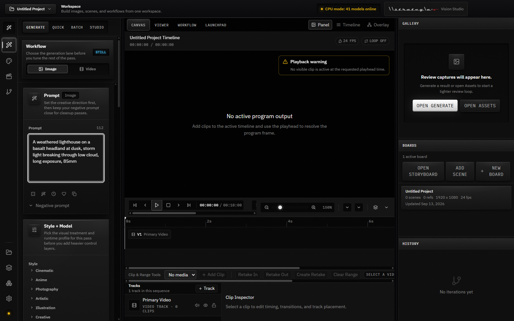
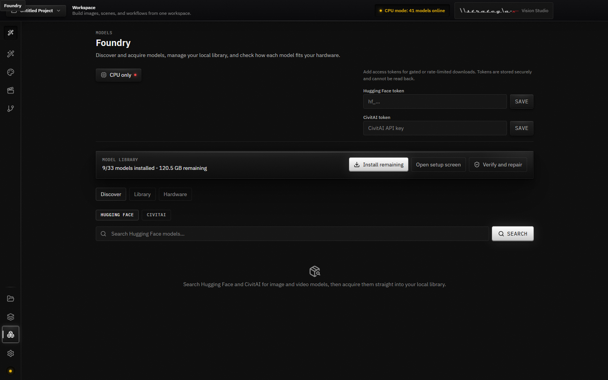
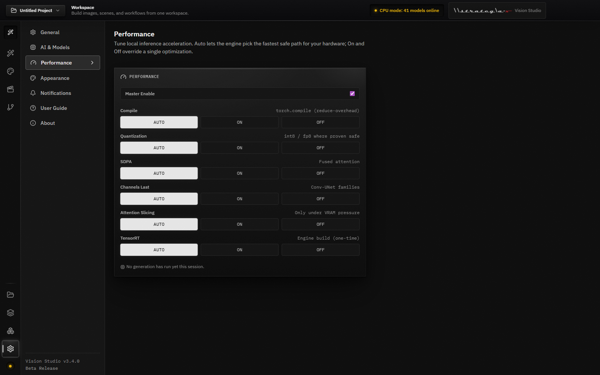
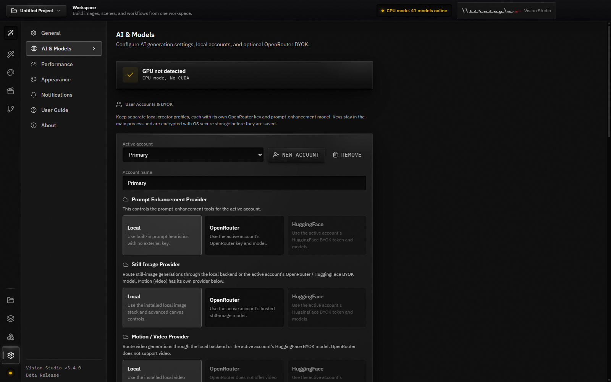
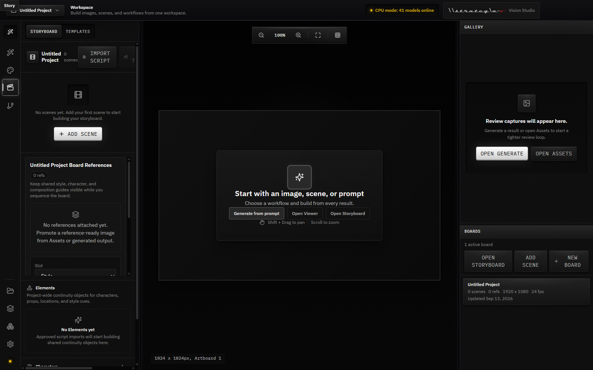
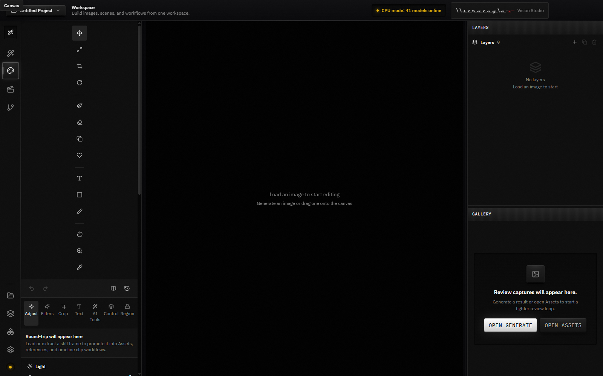

# Vision Studio-X

[](https://github.com/Git-Rocky-Stack/vision-studio/actions/workflows/pr-gate.yml)
[](https://github.com/Git-Rocky-Stack/vision-studio/actions/workflows/release-mac-linux.yml)
[](LICENSE)
[](SECURITY.md)
[%20%7C%20Linux-lightgrey.svg)](#system-requirements)

A professional AI-powered desktop application for image and video generation. No cloud required - everything runs locally on your machine.

> **Current release: v3.4.1** - see [`CHANGELOG.md`](CHANGELOG.md) for what's new. Download at **[vision-studio-x.com/download](https://vision-studio-x.com/download)**.

## Screenshots



<table>
<tr>
<td width="50%">



**Model Foundry** - search Hugging Face and CivitAI, then acquire straight into your local library. Per-result tier, security badges and license, with pickle and `trust_remote_code` hits gated behind explicit consent.

</td>
<td width="50%">



**Per-optimization acceleration** - Auto lets the engine pick the fastest safe path for your hardware; On and Off override a single optimization. The panel reports what was applied, skipped, or fell back.

</td>
</tr>
<tr>
<td width="50%">



**Provider routing (BYOK)** - run fully local, or bring your own OpenRouter / Hugging Face key and route prompt tools, still images and video independently. Keys stay in the main process, encrypted with OS secure storage.

</td>
<td width="50%">



**Storyboard and timeline** - scenes, board references and project-wide continuity elements, onion skin across neighbouring scenes, and a timeline that exports MP4.

</td>
</tr>
</table>

<details>
<summary>One more - the Canvas layer editor</summary>



</details>

> Captured from the running application by
> [`scripts/capture-screenshots.mjs`](scripts/capture-screenshots.mjs) - no
> mock-ups and no seeded fixture data, which is why several panels show genuine
> empty states and this machine's honest "CPU mode, no CUDA" hardware readout.
> Re-run it after a UI change to keep them true.

## Features

- **Image Generation** - FLUX.1 [dev] and [schnell], Stable Diffusion 3.5 Large and Medium, Stable Diffusion XL, SD 1.5
- **Video Generation** - LTX Video and AnimateDiff from a prompt, Stable Video Diffusion from a still image; clips are written as MP4
- **Guided Edit Tools** - background removal, AI upscale, face enhancement, generative fill, object removal, AI expand, background replace, and style transfer
- **ControlNet and Reference Images** - canny, depth, pose, scribble and normal guides as canvas layers (SD 1.5, SDXL, FLUX.1 [dev], SD 3.5 Large); two or more reference layers condition a render through IP-Adapter (SD 1.5, SDXL, FLUX.1 [dev])
- **Layer Editor** - a Konva canvas with real text layers (font, color, shadow, stroke, blend), click-to-select and drag/transform, kept in sync with the tool strip, layer list, and properties panel
- **Storyboard and Timeline** - lay a project out as scenes, with onion skin ghosting the neighbouring scenes (adjustable count, opacity, and direction); cut clips on video and audio tracks and export an MP4 with cut, fade or dissolve transitions and AAC audio
- **Iteration Tree** - every render is a node; fork one to reload its prompt, model, sampler, steps, CFG and seed into the generator (re-roll draws a new seed), and record the new run as its child, with a settings diff against the parent
- **Prompt Tagging** - assets are tagged deterministically from the prompt you actually wrote (style, subject, colour, mood), on generation or on demand
- **LoRA, End to End** - install LoRAs through the Model Foundry, then stack them with per-LoRA weights in generation and in the workflow graph's `LoraLoader` node. Hosted routing is deliberately narrower than local: HuggingFace serves one FLUX LoRA per generation at weight 1.0, and OpenRouter has no LoRA contract at all - the app tells you which, rather than silently dropping the LoRA
- **Model Foundry** - search Hugging Face and CivitAI, then acquire straight into your local library: per-result tier, security badges, license, and live download status, with pickle and `trust_remote_code` hits gated behind an explicit consent step
- **Workflow Graph** - import ComfyUI API-format graphs and run them on the built-in engine; a graph with a single KSampler becomes a normal generation with its prompt, model, steps, CFG, seed and LoRAs
- **Provider Routing** - every route starts on Local; bring your own OpenRouter or Hugging Face key (BYOK) to route prompt tools and still images, or video through Hugging Face, per account. A job too large for your GPU asks before it switches route
- **AI Director** - retrieval-augmented context drawn from your own prompt history and assets, sent with prompt tools routed to OpenRouter or Hugging Face
- **GPU Acceleration** - per-optimization Performance panel (SDPA, channels-last, torch.compile, attention slicing; quantization and TensorRT when their optional packages are installed) tuned to your hardware
- **Batch Generation** - queue a list of prompts at once, one job per prompt, with one-click prompt variations
- **Project Templates** - eight starting points (YouTube thumbnail, TikTok/Reels, Instagram post, stories, cinematic wide, product showcase, AI portrait, and 4K wallpaper) that set the model, prompt scaffold, steps and CFG for a new project
- **Private by Default** - generation runs on your machine and every route starts on Local; no telemetry or analytics. The app goes online for model searches and downloads you start, an automatic update check, and any cloud route you configure

## Quick Start (End Users)

### Option 1: Download Pre-built App (Easiest)

1. Download for your platform from **[vision-studio-x.com/download](https://vision-studio-x.com/download)** - Windows x64, macOS on Apple Silicon, or Linux x64
2. Run the installer. The AI backend (PyTorch, diffusers, CUDA/MPS) is bundled - there is nothing extra to install. It unpacks itself to a temporary folder each time the app starts, which can take a few minutes
3. Builds are not yet code-signed. On Windows click **More info -> Run anyway**. On macOS 15 or later, try to open the app once, then choose **Open Anyway** under **System Settings > Privacy & Security**; on macOS 13 and 14, **right-click -> Open**. On Linux, `chmod +x` the AppImage
4. On first launch, install the one-click starter set (33 models, about 137 GB) or skip it and download only the models you want through the in-app **Foundry** (~2-24 GB per model, consent-gated) - then start creating

### Option 2: Build from Source

```bash
# Clone repository
git clone https://github.com/Git-Rocky-Stack/vision-studio.git
cd vision-studio

# Quick start (Windows)
quickstart.bat

# Or manual setup:
npm install
npm run dev
```

## Developer Setup

### Prerequisites

- **Node.js** 20 ([Download](https://nodejs.org/)) - the version CI builds and tests on
- **Python** 3.12 (for backend development) - the version every backend workflow
  pins, and the one the shipped torch build (2.5.1+cu121) has wheels for
- **CUDA 12.1** (optional, for NVIDIA GPU acceleration)

### Setup Options

#### Option A: Bundled Backend (the distribution build)

Build the native backend and package the app:

```bash
# Install frontend dependencies
npm install

# Build the native backend bundle (heavy-by-design; ~30-60 min)
npm run build:backend

# Package the full app
npm run package:win    # macOS/Linux are built in CI (PyInstaller can't cross-compile)
```

#### Option B: System Python (Development)

Use your system Python installation:

```bash
# Windows - one step: the pinned PyTorch, requirements.txt and the generation
# stack, using the release build's own install steps (needs Python 3.10-3.12)
setup-python.bat

# Linux (NVIDIA)
cd backend
python3.12 -m venv venv
source venv/bin/activate
pip install torch==2.5.1 torchvision==0.20.1 torchaudio==2.5.1 --index-url https://download.pytorch.org/whl/cu121
pip install -r requirements.txt

# macOS (Apple Silicon) - the cu121 index has no macOS wheels
cd backend
python3.12 -m venv venv
source venv/bin/activate
pip install torch==2.5.1 torchvision==0.20.1 torchaudio==2.5.1
pip install -r requirements.txt

# Then, on Linux and macOS, the generation stack
pip install "diffusers>=0.25.0" "transformers>=4.35.0" "accelerate>=0.24.0" "peft>=0.11.0" \
  "controlnet-aux>=0.0.10" "onnxruntime>=1.17" "spandrel>=0.4.0" "facexlib>=0.3.0" "aiohttp>=3.9"
cd ..
npm install
npm run dev
```

`requirements.txt` holds the server and test dependencies only. The second
`pip install` is the generation stack the release build bundles
(`BUNDLED_RUNTIME_PACKAGES` in [`build-backend.cjs`](build-backend.cjs));
without it the backend starts but cannot generate. On Windows,
`setup-python.bat` runs
[`scripts/setup-dev-backend.cjs`](scripts/setup-dev-backend.cjs), which calls
those same `build-backend.cjs` steps and finishes with the import check the
release build runs.

#### Option C: External ComfyUI (Advanced)

Vision Studio can hand work to a ComfyUI server you already run:

1. Install [ComfyUI](https://github.com/comfyanonymous/ComfyUI) separately and start it
2. Start Vision Studio. At startup the backend connects to `http://127.0.0.1:8188`,
   or to the address in the `COMFYUI_URL` environment variable (no `.env` file is read)
3. While connected, plain image jobs and image-to-video jobs run on ComfyUI;
   text-to-video jobs, and image jobs with ControlNet, reference, inpaint or other
   canvas layers, stay on the built-in engine

The hand-off uses fixed checkpoint file names (for example `flux1-dev.safetensors`)
and does not pass LoRAs. Every image-to-video job becomes ComfyUI's SVD-XT
workflow (14 frames), which does not receive the model, prompt or duration.
(3.4.1 and earlier also sent text-to-video jobs there, where they failed for want
of an input image.) Start Vision Studio without ComfyUI running to keep every job
on the built-in engine.

## Bundling the Python Backend

Vision Studio is **heavy-by-design**: every package ships the native backend
(PyTorch + diffusers + CUDA/MPS). Packaging aborts if the bundle is missing -
there is no slim or "download on first run" variant. Model *weights* are the only
thing fetched later, through the consent-gated in-app Foundry.

```bash
npm run build:backend   # PyInstaller bundle -> resources/ (only if backend/ changed)
npm run build           # frontend -> dist/
npm run package:win     # nsis-web installer + portable zip
```

See [BUNDLING.md](BUNDLING.md) for how the bundle is produced and
[DEPLOYMENT.md](DEPLOYMENT.md) for cross-platform build + R2 delivery.

## Project Structure

```
vision-studio/
├── electron/              # Electron main process
│   ├── main.ts           # App entry, backend launcher
│   ├── preload.ts        # IPC bridge
│   └── ipc-handlers/     # API handlers
│
├── backend/               # Python FastAPI server
│   ├── main.py           # FastAPI app
│   ├── main.spec         # PyInstaller config
│   ├── requirements.txt  # Python deps
│   └── utils/            # Job manager, model manager
│
├── src/                   # React frontend
│   ├── components/       # UI components (22 categories)
│   ├── pages/            # Panel views
│   ├── features/         # Domain logic per area
│   ├── store/            # Zustand state (15 slices)
│   ├── utils/            # Shared helpers, incl. the guarded bridge accessor
│   └── App.tsx           # Main app
│
├── tests/                 # Vitest integration + repo gates, Playwright E2E
│   ├── e2e/              # Playwright specs (a11y, performance, visual)
│   ├── integration/      # API contracts, store persistence
│   └── support/          # Test-only helpers (not shipped)
│
├── build-backend.cjs      # Build script
├── quickstart.bat         # Windows quick start
└── package.json
```

## Tech Stack

### Frontend
- **Electron 42** - Desktop shell
- **React 19** - UI framework
- **TypeScript** - Type safety
- **Tailwind CSS v4** - Styling
- **Framer Motion** - Animations
- **Zustand** - State management

### Backend
- **FastAPI** - API framework
- **PyTorch 2.5** (CUDA 12.1, or Metal/MPS on Apple Silicon) - ML runtime
- **Diffusers** - HuggingFace pipelines
- **WebSocket** - Real-time progress

## System Requirements

### Minimum
- Windows 10 x64 / macOS 13 (Apple Silicon) / Ubuntu 22.04 x64
- 8 GB RAM
- 10 GB free disk space
- Internet connection (first-run model downloads)

### Recommended
- Windows 11 / macOS 14 / Ubuntu 24.04
- NVIDIA GPU with 8GB+ VRAM, or Apple M-series (runs on Metal/MPS)
- 16 GB RAM
- 50 GB free disk space (for model weights)

macOS builds are **Apple Silicon (arm64) only** - PyTorch dropped macOS x64
wheels at 2.3. On Apple Silicon the engine runs on Metal (MPS); on Windows/Linux
it runs on NVIDIA CUDA, and falls back to CPU (slowly) when no GPU is present.

### GPU Support
| GPU | VRAM | Performance |
|-----|------|-------------|
| RTX 4090 | 24 GB | ⭐⭐⭐⭐⭐ Best |
| RTX 4080 | 16 GB | ⭐⭐⭐⭐ Great |
| RTX 4070 | 12 GB | ⭐⭐⭐ Good |
| RTX 3060 | 12 GB | ⭐⭐⭐ Good |
| GTX 1080 Ti | 11 GB | ⭐⭐ Fair |
| Apple M-series | unified | ⭐⭐⭐ Metal/MPS |
| CPU Only | - | ⭐ Slow |

## API

The Python backend serves a REST API on `http://127.0.0.1:8000`. Every request
except `/`, `/api/health`, the API docs and files under `/outputs/` must carry the
`x-vision-studio-token` header. The desktop app generates that token at launch; a
backend started by hand (`python main.py`) generates one and logs it.

```bash
# Generate image (returns a job_id)
POST /api/generate/image
x-vision-studio-token: <token>
{
  "prompt": "a beautiful landscape",
  "width": 1024,
  "height": 1024,
  "model": "flux-dev"
}

# Get job status (result.images holds /outputs/... paths when complete)
GET /api/jobs/{job_id}

# WebSocket for real-time updates (token as a query parameter)
ws://127.0.0.1:8000/ws?token=<token>
```

## Troubleshooting

### "Backend not found"
- The bundled backend unpacks itself to a temporary folder each time it starts, which can take several minutes; restart the app and give it time, or start it from **Settings > AI & Models**
- From source: build the backend with `npm run build:backend`, or use system Python (`setup-python.bat` on Windows; on Linux and macOS, the steps under Developer Setup)

### "CUDA out of memory"
- Reduce image resolution
- Close other GPU apps
- Use smaller models (SD 1.5 instead of FLUX); the Foundry shows how each model fits your GPU
- The engine already retries a model load that runs out of memory, stepping down through fp16, CPU offload, VAE tiling and maximum attention slicing before it gives up

### Slow generation
- Check GPU is detected in **Settings > AI & Models**
- Check the Performance panel's master switch is on (it is by default)
- Lower step count (25 → 20)

### Models not downloading
- Check internet connection
- Gated models (FLUX.1 [dev], Stable Diffusion 3.5): accept the license on Hugging Face (the Foundry's **Accept license** link opens it) and paste an access token into the Foundry header. It is saved encrypted and kept across launches, or kept until you quit where the OS offers no encryption (3.4.1 and earlier keep it only until you quit)
- Or download the files yourself and add their folder with **Add folder** in the Foundry's library roots

## Testing

```bash
# Unit + component + integration tests (Vitest)
npm test

# Watch mode
npm run test:watch

# Specific test layers
npm run test:unit          # Pure logic + store + Electron services
npm run test:component     # React component tests (jsdom)
npm run test:integration   # API contracts, store persistence, workflows

# TypeScript type-check
npm run typecheck

# E2E tests (requires `npm run build` first)
npm run test:e2e           # Playwright + Electron
npm run test:e2e:headed    # With visible browser window
npm run test:a11y          # Accessibility smoke tests only
npm run test:perf          # Performance budgets (in-page measurement)
npm run test:visual        # Visual regression (snapshots are Windows-authored)

# Backend tests
cd backend && python -m pytest
```

> Run the backend suite with **pytest**, not `python -m unittest discover` - the
> latter silently skips the pytest-style suites (security sanitization, DB
> migrations). CI runs `python -m pytest` ([`.github/workflows/pr-gate.yml:109`](.github/workflows/pr-gate.yml)).

Counts below were measured at v3.4.0; re-run the command in each row to confirm.

| Layer | Framework | Files | Tests | What it covers |
|-------|-----------|-------|-------|----------------|
| Unit + Component + Integration (`npx vitest run`) | Vitest 4.1 | 235 | 2046 | Pure logic, Zustand store, Electron services, React components, API/workflow contracts, plus repo gates: Carbon Pro tokens, palette discipline, UI glyphs, preload-bridge mount paths, Playwright port, CI type-check, archived-doc provenance, shipped dependency overrides, pinned torch stack |
| E2E + Visual (`npx playwright test --list`) | Playwright 1.58 | 9 | 36 | Electron end-to-end, accessibility (axe-core), performance budgets, and the Windows visual-regression suite |
| Backend (`cd backend && python -m pytest`) | pytest | 124 | 1108 | FastAPI + foundry + services; import-safe collection on CI, real model runs are local |
| Backend benchmarks (opt-in) | pytest-benchmark | 1 | 1 | Excluded from the default run by `backend/pytest.ini`; needs the GPU/model stack |

## Documentation

Full technical documentation lives in [`docs/`](docs/). Start with the index:

| Doc | What it covers |
|-----|----------------|
| [`docs/INDEX.md`](docs/INDEX.md) | Documentation entry point - read this first |
| [`docs/ARCHITECTURE.md`](docs/ARCHITECTURE.md) | Process model, source layout, data flows, persistence, security, build, release |
| [`docs/API_ENDPOINTS.md`](docs/API_ENDPOINTS.md) | Electron IPC + backend REST + WebSocket + OpenRouter - every channel and endpoint |
| [`docs/DATABASE_SCHEMA.md`](docs/DATABASE_SCHEMA.md) | SQLite schema, ER diagram, migration runner, how to add a migration |
| [`docs/api/openapi.json`](docs/api/openapi.json) | Machine-readable OpenAPI 3.0 spec (paste into Swagger UI / Redoc) |
| [`docs/diagrams/diagrams.md`](docs/diagrams/diagrams.md) | Standalone Mermaid diagram library for slides and presentations |

Build & release: [`BUNDLING.md`](BUNDLING.md) · [`WINDOWS_BUILD.md`](WINDOWS_BUILD.md) · [`DEPLOYMENT.md`](DEPLOYMENT.md)

The running backend also serves a live, fully introspectable spec at:

- **Swagger UI** - `http://127.0.0.1:8000/api/docs`
- **ReDoc** - `http://127.0.0.1:8000/api/redoc`
- **Raw JSON** - `http://127.0.0.1:8000/api/openapi.json`

## Contributing

Contributions welcome. Read [CONTRIBUTING.md](CONTRIBUTING.md) for the workflow
and coding standards, and [CODE_OF_CONDUCT.md](CODE_OF_CONDUCT.md) for what is
expected of everyone taking part.

```bash
# Fork and clone
git clone https://github.com/Git-Rocky-Stack/vision-studio.git

# Create branch
git checkout -b feature/amazing-feature

# Commit and push
git commit -m "Add amazing feature"
git push origin feature/amazing-feature

# Open Pull Request
```

## Security

Vision Studio runs models on your own hardware and downloads weights from
third-party hosts, so its security surface is unusual for a desktop app.
[SECURITY.md](SECURITY.md) sets out what counts as a vulnerability, what is
explicitly out of scope (unsigned installers are a known, documented state), and
how to report one privately.

**Do not open a public issue for a vulnerability.** Email
[security@vision-studio-x.com](mailto:security@vision-studio-x.com) or open a
[private advisory](https://github.com/Git-Rocky-Stack/vision-studio/security/advisories/new).

## License

MIT License - see [LICENSE](LICENSE). Vision Studio bundles third-party runtime
dependencies and provisions AI models under their own terms; every one is listed
in [THIRD-PARTY-LICENSES.md](THIRD-PARTY-LICENSES.md), which ships inside each
installer alongside the MIT text.

## Acknowledgments

- [Black Forest Labs](https://blackforestlabs.ai/) - FLUX models
- [Stability AI](https://stability.ai/) - Stable Diffusion
- [Lightricks](https://www.lightricks.com/) - LTX Video
- [ComfyUI](https://github.com/comfyanonymous/ComfyUI) - Node system

---

**Star this repo if you find it useful!**

Built with ❤️ for creators who want AI without the cloud.
