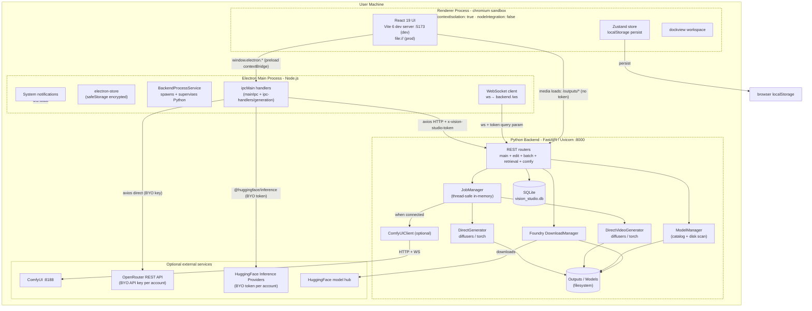
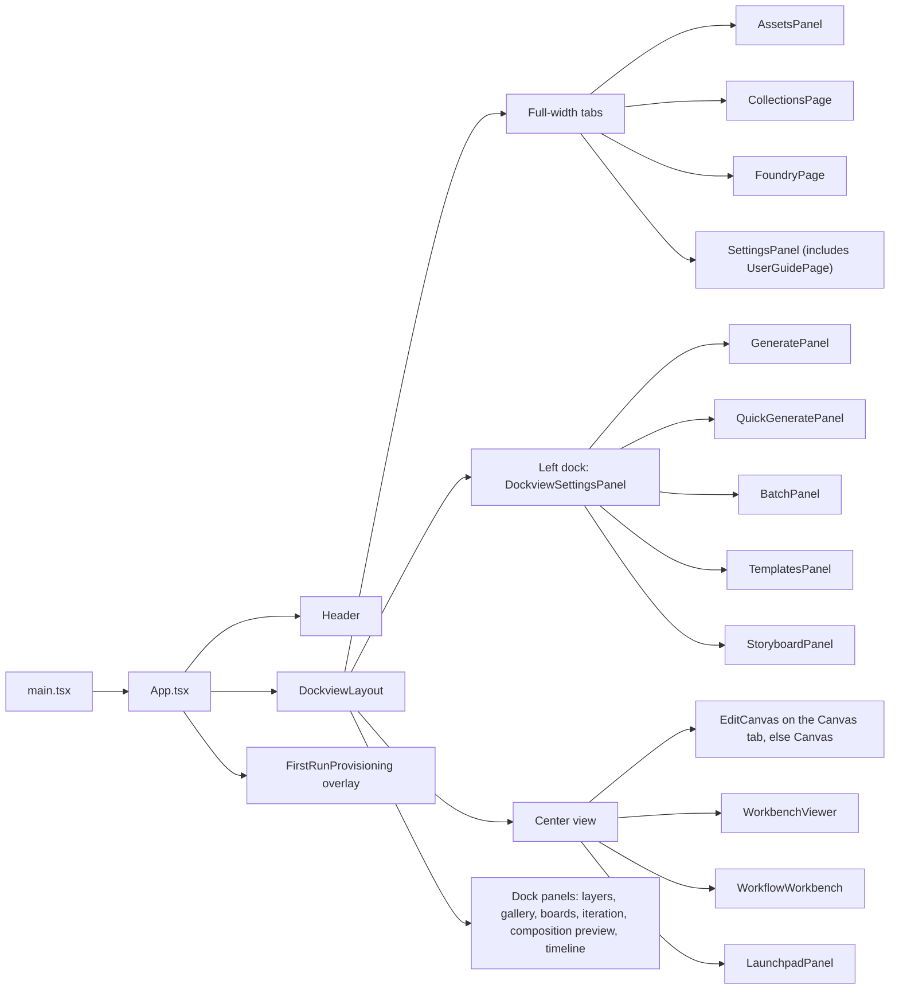
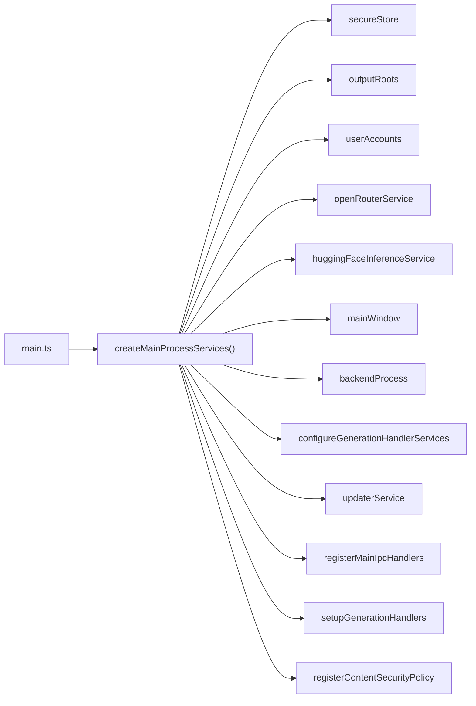
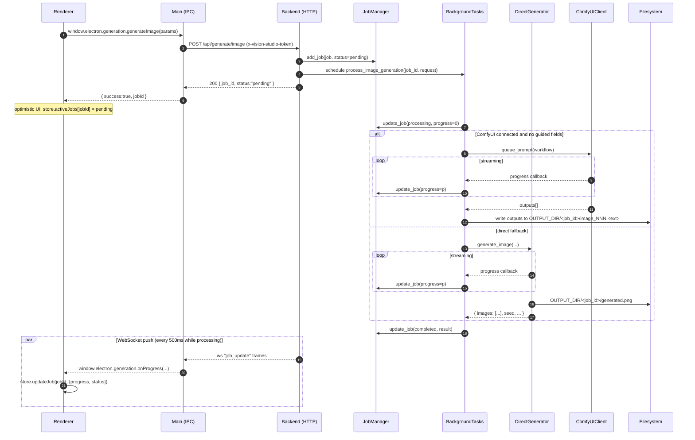
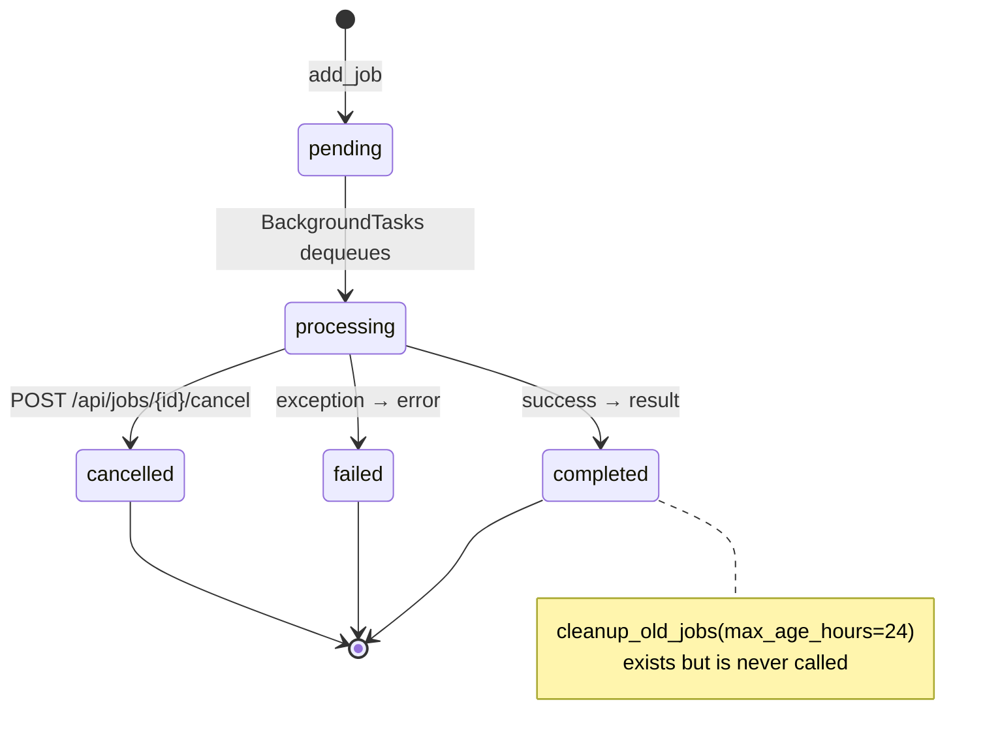
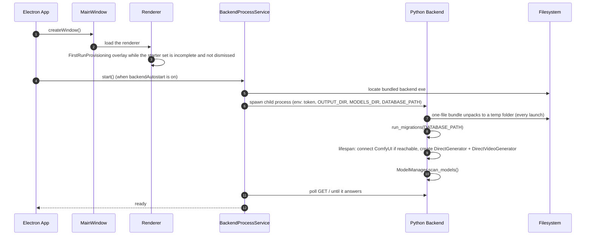
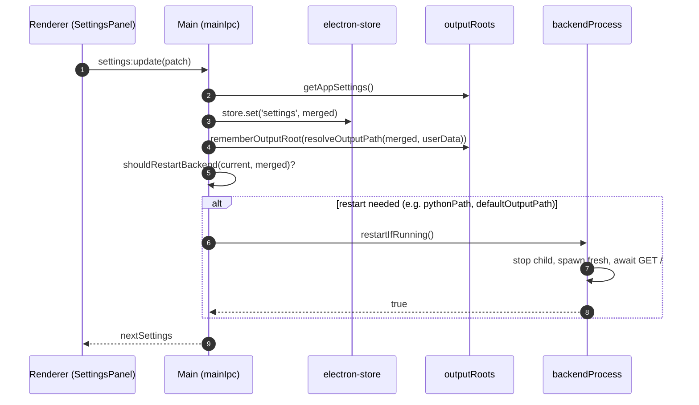
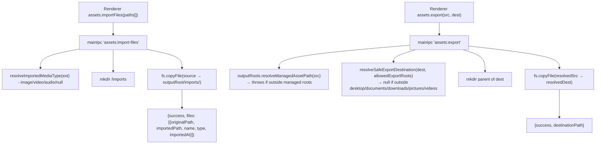
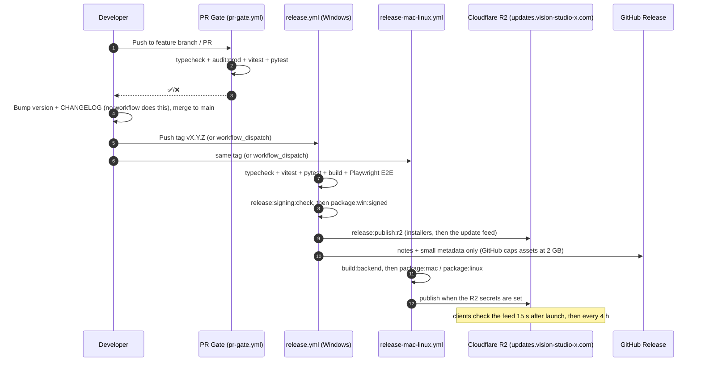

# Vision Studio - System Architecture

> Version: tracks `package.json` (currently **3.4.1**)
> Audience: contributors, integrators, security reviewers
> Companion docs: [`API_ENDPOINTS.md`](./API_ENDPOINTS.md), [`DATABASE_SCHEMA.md`](./DATABASE_SCHEMA.md), [`api/openapi.json`](./api/openapi.json)

Vision Studio is a local-first, Electron-shelled desktop app that drives an out-of-process Python (FastAPI + PyTorch) backend for AI image and video generation. This document is the canonical map of how the three processes are wired together, where state lives, and where the trust boundaries are.

---

## 1. Process model



Three OS processes, never co-mingled:

| Process | Runtime | Trust | Lifetime |
|---------|---------|-------|----------|
| **Renderer** | Chromium + V8 (sandboxed) | UNTRUSTED - handles user input | per `BrowserWindow` |
| **Main** | Node.js (Electron 42) | TRUSTED - file system, OS, processes | app lifetime |
| **Backend** | CPython 3.12 (PyInstaller-frozen in prod) | TRUSTED - GPU, torch, downloads | child of Main; auto-restart on settings change |

API calls from the renderer never go to the backend directly: they are brokered through `ipcMain.handle(...)` in the Main process, which adds the auth token. The one direct path is media: the renderer loads `/outputs/*` images and videos from `http://localhost:8000` (`src/components/ui/MediaPreview.tsx`, `src/features/assets/assetRecords.ts`; the CSP allows `img-src` from localhost), and `/outputs/*` needs no token.

---

## 2. Source layout

```
vision-studio/
├── electron/                        # Main + preload (TypeScript, ESM)
│   ├── main.ts                      # Bootstrap: createMainProcessServices + lifecycle
│   ├── preload.ts                   # contextBridge.exposeInMainWorld('electron', …)
│   ├── ipc-guard.ts                 # Loaded FIRST - guards ipcMain registrations
│   ├── ipc-handlers/
│   │   └── generation.ts            # Backend proxy, OpenRouter + HF routing, models, provisioning
│   └── services/                    # Composable main-process services (DI)
│       ├── mainProcess.ts           # Composition root
│       ├── mainIpc.ts               # App, settings, accounts, assets, backend, updater IPC
│       ├── mainWindow.ts            # BrowserWindow lifecycle
│       ├── backendProcess.ts        # spawn/restart/health-check Python
│       ├── backendAuth.ts           # x-vision-studio-token mint + headers
│       ├── secureStore.ts           # electron-store + safeStorage wrapper
│       ├── outputRoots.ts           # Managed output dir whitelist
│       ├── settings.ts              # AppSettings + restart triggers
│       ├── userAccounts.ts          # Multi-account preferences (OpenRouter etc.)
│       ├── openRouter.ts            # OpenRouter API client
│       ├── security.ts              # URL/path/store-key validation
│       ├── contentSecurityPolicy.ts # CSP header injection
│       └── updater.ts               # Update check: 15 s after launch, then every 4 h
│
├── backend/                         # Python FastAPI server
│   ├── main.py                      # FastAPI app, lifespan, REST + WS
│   ├── api/                         # APIRouters mounted under /api/v1/*
│   │   ├── edit.py
│   │   ├── batch.py
│   │   ├── retrieval.py
│   │   └── comfy_graph.py
│   ├── schemas/                     # Pydantic request/response models (edit, batch, retrieval)
│   ├── services/                    # Domain services (batch_service.py, retrieval/)
│   ├── edit_tools/                  # Edit engine behind /api/v1/edit (u2net, Real-ESRGAN, GFPGAN)
│   ├── foundry/                     # Model catalog, registry, fit, downloads, acceleration
│   ├── guided/                      # ControlNet, IP-Adapter and guided-pass plumbing
│   ├── preview/                     # Tiny-VAE step previews
│   ├── middleware/rate_limit.py     # slowapi limiter + handler
│   ├── db/
│   │   ├── migrate.py               # version-numbered migration runner
│   │   ├── schema_version.py        # SCHEMA_VERSION constant + r/w
│   │   └── migrations/001_initial_schema.py
│   ├── utils/                       # job_manager, model_manager, comfy_*,
│   │                                # direct_generator, direct_video_generator,
│   │                                # image_ops, prompt_service, sanitization
│   ├── tests/                       # pytest suites (counts in §10)
│   ├── pytest.ini                   # testpaths, pythonpath, benchmark exclusion
│   ├── requirements.txt
│   └── main.spec                    # PyInstaller spec
│
├── src/                             # React renderer (TypeScript)
│   ├── App.tsx                      # Top-level shell + global keybinds
│   ├── main.tsx                     # ReactDOM.createRoot
│   ├── pages/                       # One panel per workspace tab
│   ├── components/                  # 22 component categories (canvas, edit, …)
│   ├── features/                    # Domain logic per area (assets, generate, …)
│   ├── store/
│   │   ├── appStore.ts              # Zustand root store (slices composed :984-1013)
│   │   ├── appStore.types.ts        # AppState shape
│   │   └── slices/                  # 15 feature slices
│   ├── hooks/                       # Cross-cutting hooks
│   ├── types/                       # Domain TypeScript types
│   └── utils/
│       └── electronBridge.ts        # getElectronBridge() - the only safe way to
│                                    # reach window.electron on a mount path
│
├── tests/                           # Vitest integration + repo gates, Playwright E2E
│   ├── e2e/                         # Playwright specs + fixtures + page objects
│   ├── integration/                 # API contracts, store persistence
│   └── support/                     # Test-only helpers (never imported by src/)
└── docs/                            # ← you are here
```

---

## 3. Frontend (renderer)

### 3.1 Stack

| Layer | Choice | Notes |
|-------|--------|-------|
| Framework | **React 19** | Concurrent renderer, function components only |
| Build | **Vite 6** + `@vitejs/plugin-react` | HMR in dev; static `dist/` in prod |
| Routing | - | `react-router-dom` 7 is declared in `package.json` but nothing imports it; tab and view switching is store state (`activeTab`, `centerView`) |
| Workspace | **dockview 5** | Resizable, dockable panels for the studio |
| State | **Zustand 5** + `useShallow` | One root store; sliced by feature |
| Persist | `zustand/middleware/persist` → `localStorage` | Whitelisted, capped slices (see below) |
| Styling | **Tailwind CSS v4** + `tailwind-merge` | Token-driven theme, dark/light/system |
| Anim | **Framer Motion 12** | Reduced-motion friendly |
| Drag | `@dnd-kit/core` + `@dnd-kit/sortable` | Timeline + asset library |
| Canvas | **Konva** + **react-konva** | Edit panel canvas + transforms |
| Virtual | `@tanstack/react-virtual` | Asset grids + timeline tracks |
| Floating | `@floating-ui/react` | Tooltips, popovers, menus |
| Icons | **lucide-react** | Stroke-only icon set |
| Net | **axios 1** | Used in `electron/` only - renderer talks via IPC |

### 3.2 State architecture

`src/store/appStore.ts` composes 15 slices into one Zustand store:

| Slice | Owns |
|-------|------|
| `uiSlice` | Tabs, modes, sidebars, theme preference, dock layout |
| `projectSlice` | Active `Project`, scenes, characters, region locks |
| `generationSlice` | Active jobs, queue, drafts, batch results, asset library |
| `generationPreviewSlice` | Live preview frames, comparison state |
| `editSlice` | Layers, history, image adjustments (undo/redo) |
| `iterationSlice` | Iteration nodes/branches/comparison |
| `collectionsSlice` | Collections, smart queries, tagging mode |
| `mediaTimelineSlice` | Imported media + retake takes |
| `pipelineSlice` | Multi-step generation pipelines + executions |
| `promptStudioSlice` | Prompt templates + composition layers |
| `timelineSlice` | Sequences, tracks, clips, transitions, beats |
| `workflowSlice` | Workflow graph + runs |
| `modelsSlice` | Foundry catalog, downloads, library roots, Hub search |
| `provisioningSlice` | First-run starter-set status and whether the overlay was dismissed |
| `accelerationSlice` | Acceleration settings and the last applied readout |

Persistence is opt-in per field (see `appStore.ts` `partialize`) and capped - e.g. `promptHistory.slice(0, 50)`, `assetLibrary.slice(0, 500)`. This prevents `localStorage` blowup as users iterate on prompts.

### 3.3 Renderer ↔ main contract

The renderer NEVER imports `electron`, `fs`, `path`, or `child_process`. It only sees `window.electron`, defined in `electron/preload.ts` and exposed via `contextBridge.exposeInMainWorld('electron', electronAPI)`. The `ElectronAPI` TypeScript interface is the single source of truth - every IPC channel has a matching method here.

Top-level namespaces on `window.electron`:

- `app` - version, paths, open external/path
- `dialog` - folder/media/save pickers
- `store` - generic key/value (whitelisted by `isAllowedStoreKey`)
- `settings` - typed `AppSettings` get/update/reset
- `accounts` + `openrouter` - multi-account preferences and OpenRouter API client
- `assets` - import/export/delete/reveal/clear-cache
- `generation` - image/video/timeline/batch/enhance/negative-prompt/crop/extract-frame/`editImage` + status/cancel/list/onProgress/onStepImage
- `director` - AI Director retrieval index: sync, ingest, clear, stats
- `workflow` - `runGraph` for an imported ComfyUI graph
- `system` - GPU + backend info (one call combines both)
- `hardware` - hardware profile used for model fit
- `models` - Foundry catalog, downloads, library roots, Hub search, consent, conversion
- `provisioning` - first-run starter set: status, start, pause, resume, cancel, reverify
- `auth` - session Hugging Face and CivitAI tokens (held in Main, never returned)
- `notifications` - `notify(type, payload)` (gated by user settings)
- `backend` - start/stop/status/checkBundled + onStatusChange
- `updater` - status, check, install + onStatus

Four push channels wrap `ipcRenderer.on(...)` and return an unsubscribe function: `generation.onProgress` (`generation:progress`), `generation.onStepImage` (`generation:step-image`), `backend.onStatusChange` (`backend:status`) and `updater.onStatus` (`updater:status`).

### 3.4 Top-level UI flow



`App.tsx` wires three lifecycle effects:

1. **Global keybinds** - `?` toggles `KeyboardShortcuts` overlay; Ctrl/Cmd+Z and Ctrl/Cmd+Y route to `appStore.undo()` / `redo()`.
2. **System info polling** - calls `electron.system.getInfo()` and `electron.backend.getStatus()` on mount, then every 30 s, plus an event subscription so a backend restart triggers an immediate refresh.
3. **Generation progress** - subscribes to `electron.generation.onProgress`; each push calls `updateJob(jobId, {progress, status})`.

---

## 4. Main process (Electron)

### 4.1 Composition root

`electron/main.ts` is intentionally thin (64 lines). It registers the two `auth:*` handlers, which hold the Hugging Face and CivitAI tokens for the session, and instantiates `createMainProcessServices(...)` from `electron/services/mainProcess.ts`, which wires every collaborator:



This dependency-injected design is what keeps every `services/*.ts` testable in isolation - see the `*.test.ts` files alongside each service.

### 4.2 IPC contract

Three registration sites:

1. **`services/mainIpc.ts`** - 41 channels: app, dialog, store, settings, accounts, openrouter, assets, notifications, system, backend and updater.
2. **`ipc-handlers/generation.ts`** - 43 channels: generation, models, director, provision, hardware and `workflow:run-graph`, plus the OpenRouter and Hugging Face routes and the backend WebSocket client. It forwards two push events, `generation:progress` and `generation:step-image` (`backendWsRouting.ts`).
3. **`main.ts`** - the two `auth:*` channels.

The other two push events come from `backendProcess.ts` (`backend:status`) and `updater.ts` (`updater:status`).

`electron/ipc-guard.ts` is loaded **first** in `main.ts` - before any module that may register an `ipcMain.handle`. It rejects duplicate handler registration so a stale or stray handler can never silently shadow the real one. This is one of the rare cases in this codebase where load order is load-bearing; do not move that import.

### 4.3 Backend supervision

`backendProcess.ts` is the single owner of the Python child process:

- In **dev**, runs `backend/dist/VisionStudio-Backend` if a built backend exists; otherwise spawns `<pythonPath> main.py` in `backend/` (the `pythonPath` setting, default `python`).
- In **prod**, spawns the PyInstaller one-file exe that electron-builder copies into `resources/` (`extraResources`; path: `backendProcess.getBundledBackendPath()`). A one-file exe unpacks itself to a temporary folder every time it starts.
- Mints a per-launch auth token via `backendAuth.ts`, sets it as `VISION_STUDIO_BACKEND_AUTH_TOKEN` in the child env, and passes it on every HTTP and WebSocket request via the `x-vision-studio-token` header (HTTP) or `?token=…` query (WS). The token never reaches the renderer.
- Polls `GET /` on `127.0.0.1:8000`, then `localhost:8000`, to determine readiness; shows a "Backend Not Started" dialog if the backend fails to start.
- Restarts on settings changes that affect backend behavior (`shouldRestartBackend(prev, next)` in `settings.ts`).
- Kills the child on `window-all-closed` and `before-quit` to guarantee no orphaned Uvicorn process.

**Backend lifecycle environment variables** (advanced / dev / CI use):

| Variable | Effect |
|----------|--------|
| `VISION_STUDIO_BACKEND_HOST` | Host the FastAPI backend binds to. Defaults to loopback `127.0.0.1`; set to `0.0.0.0` only for deliberate LAN/debug exposure. Read in `backend/main.py`. |
| `VISION_STUDIO_SKIP_BACKEND` | When set (truthy), the app does **not** spawn the bundled Python backend (`mainProcess.start()`). Used by E2E so a test can manage the backend itself. |
| `VISION_STUDIO_BACKEND_EXTERNAL` | When set (truthy), `getSystemInfo()` probes the backend over HTTP **even though the app did not spawn it** - so a manually-run (`python main.py`) or test-mocked backend is detected as connected. Pairs with `VISION_STUDIO_SKIP_BACKEND`. Opt-in; off by default. **In this mode you must set the same `VISION_STUDIO_BACKEND_AUTH_TOKEN` in both this app and the external backend** - otherwise each process mints its own token and authenticated requests fail with HTTP 403 (the app logs a `[backend-auth]` warning at startup and reads as disconnected). |
| `VISION_STUDIO_BACKEND_AUTH_TOKEN` | Shared per-launch auth token for the local backend. When the app **spawns** the backend it generates this and injects it into the child env automatically (`backendAuth.ts` → `buildBackendEnvironment`). When the backend runs **externally**, set it yourself to the *same* value in both processes. If unset on a bare `python main.py`, the backend fails closed by generating an ephemeral token (logged once) rather than disabling auth. |

### 4.4 Trust boundary enforcement

`security.ts`:

| Function | Purpose |
|----------|---------|
| `isSafeExternalUrl(url)` | Allows `http:` and `https:` only; rejects `mailto:`, `javascript:`, `file:` and custom schemes |
| `isAllowedStoreKey(key)` | Whitelists `settings`, `recentProjects`, `firstRun`, `modelsDownloaded`. Accounts and managed output roots are not reachable through the generic store API |
| `resolveSafeExportDestination(dest, allowedRoots)` | Confines export targets to desktop/documents/downloads/pictures/videos (deliberately not the whole home folder) |
| `toSafeRendererError(error, fallback)` | Strips paths, stack traces, and tokens before returning errors to the renderer |

`outputRoots.ts`:

| Function | Purpose |
|----------|---------|
| `resolveManagedAssetPath(assetPath)` | Resolves `/outputs/...` and bare paths against the managed output roots; throws if escaping |
| `getManagedOutputRoots()` | Returns the set of accepted roots: bundled outputs dir + user-configured + remembered |
| `rememberOutputRoot(root)` | Records a new managed root after a settings change so old assets remain reachable |

Renderer-supplied paths to read, open or export pass through `resolveManagedAssetPath` or `resolveSafeExportDestination` before any `fs.*` call, and opening an executable is refused. The exception is `assets:import-files`: it accepts any source path whose extension is a supported image, video or audio type and copies it into `<outputRoot>/imports/`.

`secureStore.ts` encrypts the whole `electron-store` file with a random key and keeps that key encrypted by `safeStorage`. If OS encryption is unavailable, or the key cannot be decrypted, the store stays plaintext for that launch and logs a warning. BYOK secrets (OpenRouter keys and Hugging Face account tokens) are encrypted again with `safeStorage` in `userAccounts.ts`, which refuses to store them when OS encryption is unavailable.

### 4.5 OpenRouter integration

`openRouter.ts` is a typed client for the [OpenRouter](https://openrouter.ai) REST API. It supports two routes:

- **Prompt enhancement / negative-prompt suggestion** - used when the active account's `promptEnhancementProvider === 'openrouter'`.
- **Still-image generation** - used when `imageGenerationProvider === 'openrouter'`. Generated images are written to `<outputRoot>/openrouter/YYYY-MM-DD/<jobId>-<n>.<ext>` and surfaced as if they came from a local job.

OpenRouter jobs run **entirely in the Main process**. They get their own job IDs (`openrouter-image-<uuid>`), their own in-memory map (`openRouterImageJobs`), and they emit `generation:progress` events themselves - the renderer cannot tell whether a job is local or routed. The Python backend is bypassed for these flows.

If the OpenRouter account is misconfigured for a particular request (no key, no model, ControlNet/inpaint inputs which OpenRouter doesn't support yet) the handler returns a structured `{ success: false, error }` rather than failing silently.

---

## 5. Backend (FastAPI + PyTorch)

### 5.1 App composition

`backend/main.py` builds the FastAPI app at import time:

```python
app = FastAPI(
    title="Vision Studio API",
    version=APP_VERSION,                                  # backend/version.py
    docs_url="/api/docs",
    redoc_url="/api/redoc",
    openapi_url="/api/openapi.json",
    lifespan=lifespan,
)

app.state.limiter = limiter                                # slowapi
app.add_exception_handler(RateLimitExceeded, rate_limit_exceeded_handler)

@app.middleware("http")
async def require_local_auth_token(request, call_next): ...   # x-vision-studio-token

@app.middleware("http")
async def log_requests(request, call_next): ...               # request_id + duration

app.add_middleware(CORSMiddleware,
    allow_origins=["http://localhost:5173", "http://127.0.0.1:5173"], ...)

app.mount("/outputs", StaticFiles(directory=OUTPUT_DIR), name="outputs")

app.include_router(edit_router)         # /api/v1/edit/*
app.include_router(batch_router)        # /api/v1/batch/*
app.include_router(retrieval_router)    # /api/v1/retrieval/*
app.include_router(comfy_graph_router)  # /api/v1/comfy/*
```

Notable invariants:

- **Bind address**: Uvicorn binds `127.0.0.1:8000` (`VISION_STUDIO_BACKEND_HOST` overrides the host), and Electron connects to `127.0.0.1`. If you change the bind, also update the firewall/CSP story - the assumption "only this machine talks to this backend" is load-bearing.
- **Auth**: every request must carry `x-vision-studio-token: <token>`. Electron generates the token and passes it as `VISION_STUDIO_BACKEND_AUTH_TOKEN`; a backend started without it generates an ephemeral token and logs it, so auth fails closed. Exempt paths: `/`, `/api/health`, `/api/docs`, `/api/redoc`, `/api/openapi.json`, `/outputs/*`. The WebSocket accepts the token as a query parameter and closes with code 1008 on mismatch.
- **CORS**: Restricted to the Vite dev origins only. The production renderer loads from `file://` and sends API calls through Electron-proxied IPC; its only direct requests to the backend are media loads from `/outputs/*`.
- **Rate limiting**: `slowapi` limiter, keyed by client IP. Categories: `generate` 10/min, `edit` 30/min, `batch` 5/min, `default` 60/min. `/api/health`, the `/ws` WebSocket and the `/api/v1/retrieval` routes are not limited.
- **Static serving**: `/outputs/*` is mounted directly so the renderer can render generated assets via `` without a separate IPC round-trip.

### 5.2 Generation pipeline (image)



Notes:

- **ComfyUI is optional.** If the `ComfyUIClient` import fails, `comfy_client` stays `None`; if `connect()` fails at startup, the client exists but reports disconnected. Either way every job goes through `DirectGenerator`. Requests with guided fields (ControlNet, reference images, inpaint, outpaint, background replace) use `DirectGenerator` even when ComfyUI is connected. Both paths are tested.
- **Outputs are namespaced by `job_id`** so concurrent jobs cannot collide on filenames.
- **Seed handling**: `-1` is a sentinel meaning "random" and gets resolved (and reported) by the generator so the user can re-roll deterministically.

### 5.3 Generation pipeline (video)

Same shape as image, but:

- Uses ComfyUI whenever it is connected (`generate_video_with_comfyui`): a fixed SVD-XT image-to-video workflow of 14 frames that ignores the model, prompt, duration and LoRAs. Each output file is saved as `OUTPUT_DIR/<job_id>/video_NNN.<ext>` (`.webp` by default) and returned as `videos`.
- Otherwise uses `DirectVideoGenerator`, which writes one `video.mp4` per job via `imageio`.

### 5.4 Timeline export

`POST /api/timeline/export` is a different beast. The renderer resolves which clips contribute to which output frames, then submits the **fully resolved** frame stream + audio plan. The backend:

1. Renders each frame as an RGB PIL image (compositing layers via `Image.alpha_composite`, fitting via `Image.thumbnail`, applying per-layer opacity).
2. Encodes the frame stream into an MP4 via `imageio.get_writer(output_path, fps=...)`.
3. If `audio_layers` is non-empty, writes an intermediate `*-silent.mp4`, then runs `ffmpeg` (via `imageio_ffmpeg.get_ffmpeg_exe()`) with a generated `-filter_complex` graph that:
   - `atrim`s each source by `source_time_ms` + `duration_ms`,
   - normalizes PTS,
   - applies fade-in/out via a piecewise `volume=` expression,
   - delays via `adelay`,
   - and either passes through (1 audio layer) or `amix`es (2+) into the final track.
4. Mux is `-c:v copy -c:a aac -b:a 192k -movflags +faststart` for fast scrubbing in viewers.

The job is registered in `JobManager` and reports progress via the same WebSocket channel (renderer poll/streaming reads via `generation:progress`). Failures are surfaced through `update_job(status=FAILED, error=...)` rather than an HTTP error - the HTTP request only kicks off the background task.

### 5.5 Job lifecycle



The current `JobManager` is **in-memory only** - a `Dict[str, GenerationJob]` guarded by a `threading.Lock`. Nothing prunes it, so finished jobs stay until the backend restarts, which wipes job state. Cancel acts only on a `processing` job; any other status gets `Job is already <status>`. The `jobs` SQLite table exists (see [`DATABASE_SCHEMA.md`](./DATABASE_SCHEMA.md)) but is not yet wired to the manager; persisting through restarts is a known follow-up.

### 5.6 Module-level routers

Each `/api/v1/*` router lives in `backend/api/<area>.py` and delegates to the implementation below. ControlNet and LoRA no longer have routers: they are fields of `POST /api/generate/image` (and `loras` of `/api/generate/video`).

| Router | Prefix | Tag | Implementation | Notes |
|--------|--------|-----|----------------|-------|
| `edit.py` | `/api/v1/edit` | `Edit` | `backend/edit_tools/service.py` (`run_edit_operation`) | U2-Net background removal on onnxruntime, Real-ESRGAN upscale (2x/4x, general or anime), GFPGAN face restore |
| `batch.py` | `/api/v1/batch` | `Batch` | `backend/services/batch_service.py` | ZIP export, format conversion (png/jpg/webp), optional resize |
| `retrieval.py` | `/api/v1/retrieval` | `Retrieval` | `backend/services/retrieval/` | AI Director index: ingest, query, clear, stats |
| `comfy_graph.py` | `/api/v1/comfy` | `ComfyUI Interop` | `backend/utils/comfy_graph_guard.py` + `comfy_client.py` | Forwards an allow-listed API-format graph to a connected ComfyUI (409 when none) |

The edit, batch and comfy routers apply `slowapi` limits (`@limiter.limit(LIMITS["..."])`); the retrieval router has none. Batch and retrieval raise structured `{error, error_code}` details; edit and comfy raise plain-string details.

### 5.7 Sanitization

`backend/utils/sanitization.py` provides:

| Function | Used for |
|----------|----------|
| `sanitize_path(path)` | Path-traversal prevention on batch `image_ids` and on ComfyUI graph string inputs |
| `sanitize_model_name(name)` | Model-name inputs in imported ComfyUI graphs (`comfy_graph_guard.py`) |
| `sanitize_prompt(text)` | Defined and unit-tested, but no route calls it: prompts reach the generators as typed |
| `validate_base64(data)` | Defined and unit-tested, but no route calls it (edit requests take file paths, not base64) |

Only the path and model-name validators are wired into routes today.

---

## 6. Data flows

### 6.1 First launch



Why this matters: startup can take **minutes**, because the one-file backend unpacks itself to a temporary folder every time it starts. If the readiness probe times out, the Main process shows a "Backend Not Started" dialog (`mainProcess.ts`) that mentions extraction time - do not race past it.

### 6.2 Settings update with backend restart



`shouldRestartBackend` returns `true` only when a setting actually affects backend behavior - purely cosmetic settings (theme) skip the restart. Renderers receive the merged settings synchronously from the IPC reply.

### 6.3 Asset import vs export (security paths)



Key invariant: **export sources are confined to managed output roots** and **export destinations to OS user directories**. Import is the exception: its sources are checked only by file extension, then copied into the managed `imports/` folder. Cross-direction escapes return structured errors rather than throwing; the renderer treats both as recoverable.

---

## 7. Persistence

State is split across **four** stores. Knowing where each lives is essential.

| Store | Backed by | Owner | Lifetime | Examples |
|-------|-----------|-------|----------|----------|
| **Renderer Zustand persist** | `localStorage` | Renderer | Per-window-profile | UI prefs, prompt history (capped 50), custom style presets, recent projects, batch results (capped 200), asset library cache (capped 500) |
| **electron-store** | JSON file in `userData` (whole file encrypted with a `safeStorage`-protected key when OS encryption is available; BYOK secrets encrypted again) | Main | Per-OS-user-install | App settings, recent projects, first-run flag, downloaded models registry, managed output roots, **multi-account preferences and OpenRouter API keys** |
| **In-memory `JobManager`** | Python dict + lock | Backend | Per-backend-process | Active and recent jobs, progress, results |
| **SQLite (`vision_studio.db`)** | File in `<userData>/data/vision_studio.db` | Backend | Per-OS-user-install | `images`, `jobs`, `settings`, `schema_version` (see [`DATABASE_SCHEMA.md`](./DATABASE_SCHEMA.md)). Schema is provisioned by migrations but **most fields are not yet populated by the running app** - they exist for future job-history persistence. |

**Filesystem state** sits underneath all of this:

| Path | Created by | Contains |
|------|------------|----------|
| `<userData>/outputs/` | Main default (`settings.ts`), passed to the backend as `OUTPUT_DIR` | `<job_id>/generated.png` (built-in engine), `<job_id>/image_NNN.<ext>` (ComfyUI), video files, derivative crops/upscales/frames |
| `<userData>/outputs/imports/` | Main (`assets:import-files`) | User-imported media |
| `<userData>/outputs/openrouter/YYYY-MM-DD/` | Main (OpenRouter image fan-out) | Images returned by OpenRouter |
| `<userData>/models/` | Backend (`ModelManager`) | Downloaded model weights (multi-GB) |
| `<userData>/data/vision_studio.db` | Backend (migrations) | SQLite database |

---

## 8. Security model

### 8.1 Trust hierarchy

| Layer | Trust | Hardening |
|-------|-------|-----------|
| Renderer | Untrusted - arbitrary user input, web technology | `contextIsolation: true`, `nodeIntegration: false`, no remote module, CSP via `contentSecurityPolicy.ts` |
| Preload | Mediator | Exposes ONLY the typed `electron` namespace; no `process`, `require`, or `electron` re-exports |
| Main | Trusted | Path/URL/store-key validation on untrusted input (import paths are extension-checked only); mostly `fs.promises`, with a few sync calls (`secureStore.ts`, `backendProcess.ts`, the import name check) |
| Backend | Trusted | Localhost-only; per-launch token; Pydantic validation; rate-limited (not `/api/health`, `/ws` or retrieval); path and model-name inputs sanitized |

### 8.2 Threat model summary

| Threat | Mitigation |
|--------|------------|
| Malicious paths in IPC (`../../etc/passwd`) | `resolveManagedAssetPath` + `resolveSafeExportDestination` confine I/O |
| Malicious `open-external` URL | `isSafeExternalUrl` whitelist |
| Malicious store key write | `isAllowedStoreKey` whitelist |
| Local user runs another HTTP client against `:8000` | `x-vision-studio-token` per-launch auth (the renderer never holds the token; Main adds it to every backend request). `/outputs/*` is exempt, so any local process can fetch generated media, which is also on disk |
| OpenRouter key disclosure | Stored encrypted via OS keychain; never returned to the renderer in plaintext |
| Backend stack traces leaking to renderer | `toSafeRendererError` strips paths/stacks; Pydantic + `HTTPException` deliver structured errors |
| FFmpeg shell injection (timeline export) | Audio command built as `argv` array with `subprocess.run(check=True, capture_output=True)` - no shell |
| Rate-limit-bypassed expensive endpoints | `slowapi` `@limiter.limit` on every `main.py` HTTP route except `/api/health`, and on the edit, batch and comfy routers; the retrieval router is not limited. Limits are per-IP |
| Migration data loss | Migrations are append-only and version-numbered. A failed migration is logged and skipped, and later ones still run (`db/migrate.py`) |

### 8.3 Files to read for security work

- `electron/services/security.ts` - URL/path/key validators
- `electron/services/outputRoots.ts` - managed roots
- `electron/services/secureStore.ts` - `safeStorage` fallback behavior
- `electron/services/contentSecurityPolicy.ts` - CSP headers
- `backend/middleware/rate_limit.py` - limiter
- `backend/utils/sanitization.py` - text/path/base64 validators
- `backend/main.py` - auth middleware (`require_local_auth_token`)
- `SECURITY-AUDIT-2026-04-18.md` (root) - the April 2026 audit findings

---

## 9. Build, packaging, distribution

| Stage | Tool | Output | Notes |
|-------|------|--------|-------|
| Backend build | PyInstaller (`build-backend.cjs` → `backend/main.spec`) | `backend/dist/VisionStudio-Backend(.exe)` | One-file mode: unpacks to a temporary folder every time it starts |
| Renderer build | Vite | `dist/index.html` + assets | Hashed file names; Tailwind purged to used classes |
| Main build | `vite-plugin-electron` | `dist-electron/main.mjs`, `dist-electron/preload.cjs` | Main is ESM; the preload is always CommonJS (`vite.config.ts`) |
| Packaging | electron-builder (`electron-builder.yml`, `electron-builder.windows.json`) | Windows: NSIS web installer + portable ZIP (x64). macOS: DMG + ZIP (arm64). Linux: AppImage (x64). `extraResources` copies the backend exe | Signing checks: `scripts/verify-release-signing.cjs` |
| Test gates | Vitest, Playwright, pytest | CI artefacts + JUnit | See `package.json` `test:*` scripts |
| Type and lint gates | `npm run typecheck`; ESLint (`npm run lint`, `--max-warnings=0`) | - | Only the type check runs in CI (`pr-gate.yml`, `release.yml`); lint is local |

### Production layout (Windows example)

```
%LOCALAPPDATA%\Programs\Vision Studio\
├── Vision Studio.exe               ← Electron shell
├── resources\
│   ├── app.asar                    ← compiled main + renderer
│   └── VisionStudio-Backend.exe    ← PyInstaller bundle (extraResources)
└── ...

%APPDATA%\vision-studio\           ← per-user state
├── config.json                     ← electron-store
├── outputs\                        ← OUTPUT_DIR
├── models\                         ← MODELS_DIR
└── data\
    └── vision_studio.db
```

---

## 10. Testing strategy

Counts measured at v3.4.0 with the command in each row.

| Layer | Framework | Files | Tests | Notes |
|-------|-----------|-------|-------|-------|
| Unit + integration + component | Vitest 4.1 | 232 | 2034 | Two projects in `vitest.config.ts`: `unit` (node environment) and `component` (jsdom 28 + Testing Library). `npx vitest run` |
| E2E | Playwright 1.58 + Electron | 9 | 36 | 8 of 9 specs launch the real app - 7 through `tests/e2e/fixtures/electron.fixture`, and `generate-completion.spec.ts:60` via a direct `electron.launch`. Only `performance/performance.spec.ts` uses a plain browser against `vite preview`, because Electron serves the renderer over `file://`, which yields no resource or paint timing to measure |
| Accessibility | axe-core, injected | (within E2E) | smoke | `tests/e2e/accessibility.spec.ts:49` reads `node_modules/axe-core/axe.min.js` and injects it. `@axe-core/playwright`'s `AxeBuilder` calls `context.newPage()`, which Electron's `BrowserContext` does not support |
| Visual regression | Playwright snapshots | (within E2E) | - | `npm run test:visual`. Snapshots are Windows-authored; only that platform compares meaningfully |
| Backend | pytest | 118 | 1108 | `backend/pytest.ini` sets testpaths and excludes the benchmark tier. `cd backend && python -m pytest` |
| Backend benchmarks | pytest-benchmark | 1 | 1 | Opt-in; needs the GPU/model stack |

### Repo gates

Tests that pin an invariant rather than a behaviour. Each exists because the
thing it checks failed silently at least once.

| Gate | Guards against |
|------|----------------|
| `tests/electron-bridge-mount-paths.test.ts` | A `window.electron` dereference on a mount path. `src/types/electron.d.ts:509` declares the bridge required, so the compiler cannot see that it is absent under `vite preview` and the dev server |
| `tests/ci-typecheck-gate.test.ts` | A CI type-check that compiles zero files (see below) |
| `tests/playwright-config.test.ts` | The E2E preview server binding a shared Vite default port, where `reuseExistingServer` can adopt an unrelated project's build |
| `tests/version-sync.test.ts` | `package.json`, the OpenAPI spec, the README release line, and the CHANGELOG heading drifting apart |
| `tests/docs-links.test.ts` | A dead relative link in a public doc - checked case-exactly, because NTFS/APFS resolve what GitHub 404s |
| `src/**/carbon-pro-tokens.test.ts`, `ui-glyphs.test.ts` | Design-token and glyph drift from `DESIGN.md` |

### CI gates

**PR gate** - [`.github/workflows/pr-gate.yml`](../.github/workflows/pr-gate.yml), four
parallel jobs, all required:

| Job | Command | Line |
|-----|---------|------|
| TypeScript | `npm run typecheck` | `:35` |
| Dependency Audit (shipped) | `npm run audit:prod` | `:55` |
| Frontend Tests | `npx vitest run` | `:72` |
| Backend Tests | `python -m pytest` | `:109` |

> The TypeScript job ran `npx tsc --noEmit` until v3.4.0. `tsconfig.json` is a
> solution file (`"files": []` plus `references`), and TypeScript only follows
> references under `--build` - so that command compiled **zero** files and the job
> was green by construction. Measured, not inferred: with a deliberate
> `TS2322` in `src/utils/electronBridge.ts`, `npx tsc --noEmit` exits 0 and
> `npm run typecheck` exits 2. `tests/ci-typecheck-gate.test.ts` now fails the
> suite if either gating workflow reverts to the bare form, or if a project is
> added to `references` without being added to the `typecheck` script.

**Release gate** - [`.github/workflows/release.yml`](../.github/workflows/release.yml)
runs the PR gate's type check, Vitest and pytest (not the dependency audit), plus
`npm run build` (`:58`), the Playwright E2E suite
(`:66`), `npm run release:signing:check` (`:102`), and `npm run package:win:signed`
(`:121`).

`npm run lint` is **not** run by any workflow. The script exists
(`eslint src electron --max-warnings=0`) and is worth running locally, but it does
not gate a merge; do not read a green PR Gate as a lint pass.

---

## 11. Deployment / release flow



Local rehearsal: `npm run test:build` (= `build:windows` + a sanity message).

---

## 12. Operational reference

| Task | Command |
|------|---------|
| Dev (renderer + main; backend from `backend/dist` or `pythonPath`) | `npm run dev` |
| Run backend manually | `cd backend && python main.py` |
| Build Python bundle | `npm run build:backend` |
| Package signed Windows installer | `npm run package:signed` |
| Run all Vitest | `npm test` |
| Backend tests | `cd backend && python -m pytest` |
| E2E (requires built app) | `npm run build && npm run test:e2e` |
| Type check | `npm run typecheck` |
| Lint | `npm run lint` |
| Clean (preserve venv) | `npm run clean` |
| Clean (purge venv + node_modules) | `npm run clean:all` |

---

## 13. Where to start as a new contributor

1. **Read this doc end-to-end.** Then [`API_ENDPOINTS.md`](./API_ENDPOINTS.md) and [`DATABASE_SCHEMA.md`](./DATABASE_SCHEMA.md).
2. **Wire the dev loop:** `npm install`, then set up the backend as in the README's [Option B](../README.md#option-b-system-python-development) (`setup-python.bat` installs only `requirements.txt`, which leaves the generation stack commented out), then `npm run dev`.
3. **Open a panel and trace one feature end-to-end.** A great first read is the image-generation flow:
   - `src/pages/GeneratePanel.tsx` (entry point UI)
   - `src/store/slices/generationSlice.ts` (action + state)
   - `electron/preload.ts` → `electron.generation.generateImage`
   - `electron/ipc-handlers/generation.ts` → `generation:generate-image` handler
   - `backend/main.py` → `POST /api/generate/image` → `process_image_generation` → `DirectGenerator`
4. **Run the relevant tests** for whatever you change. CI will not be merciful.
5. **Update this doc** if your change moves a boundary - modules, processes, or stores.

---

_Whole-document verification against the codebase: 2026-05-03, at v2.5.0._

_Re-checked 2026-09-18 at v3.4.1: the present-tense claims in every section were
compared with the tree and corrected where they had drifted. The §10 file and
test counts are still the ones measured at v3.4.0._

_Canonical source: `package.json`, `backend/main.py`, `electron/services/mainProcess.ts`, `electron/preload.ts`, `backend/db/migrations/001_initial_schema.py`._
