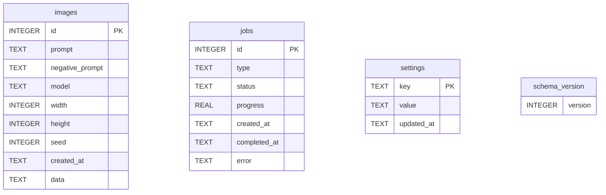

# Vision Studio — Database Schema

> Companion docs: [`ARCHITECTURE.md`](./ARCHITECTURE.md), [`API_ENDPOINTS.md`](./API_ENDPOINTS.md)
> Source of truth: `backend/db/migrations/*.py`, `backend/db/schema_version.py`

This document covers the **server-side SQLite database** used by the Python backend. Other Vision Studio state lives elsewhere (see [`ARCHITECTURE.md` §7](./ARCHITECTURE.md#7-persistence)) — `electron-store`, Zustand `localStorage` persist, and the in-memory `JobManager` are NOT described here.

---

## 1. Overview

| Attribute | Value |
|-----------|-------|
| Engine | **SQLite 3** (via Python stdlib `sqlite3`) |
| File | `<DATABASE_PATH>` (default `<userData>/data/vision_studio.db`; configurable via the `DATABASE_PATH` env var) |
| Schema version | **1** (constant `SCHEMA_VERSION` in `backend/db/schema_version.py`) |
| Migration model | Forward-only, version-numbered Python modules (`migrate_up` + `migrate_down`) executed in order by `db.migrate.run_migrations` |
| When run | At backend startup — `backend/main.py` calls `run_migrations(DATABASE_PATH)` before instantiating any service |
| Failure mode | First failing migration logs a warning and stops; the database stays at the last successful version |

The database is currently provisioned but **partially used**. The schema exists to support persistent generation history and settings; the running app holds most equivalent state in memory or in `electron-store` today. Treat the tables below as both a present-day reference and a forward-looking contract.

---

## 2. Entity-relationship diagram



There are no foreign keys today — the four tables are independent. Every relation between rows (e.g. "this image belongs to this job") is encoded externally via filesystem layout (`OUTPUT_DIR/<job_id>/image_NNN.png`) and the in-memory `JobManager`.

---

## 3. Tables

### 3.1 `images`

Stores metadata for generated images. **Currently provisioned by migration 001 but not yet written by the running application** — the live image-generation path persists outputs to `OUTPUT_DIR/<job_id>/image_NNN.png` and surfaces them via `/outputs/...` URLs without inserting a row. This table is the planned long-term home for image history.

| Column | Type | Constraints | Description |
|--------|------|-------------|-------------|
| `id` | INTEGER | PRIMARY KEY AUTOINCREMENT | Surrogate key |
| `prompt` | TEXT | NOT NULL | Positive prompt used for generation |
| `negative_prompt` | TEXT | DEFAULT `''` | Negative prompt, may be empty |
| `model` | TEXT | NOT NULL | Model id (e.g. `flux-dev`, `sd3.5-large`) |
| `width` | INTEGER | NOT NULL | Pixels |
| `height` | INTEGER | NOT NULL | Pixels |
| `seed` | INTEGER | NOT NULL | Resolved seed (never `-1` after generation) |
| `created_at` | TEXT | NOT NULL DEFAULT `datetime('now')` | UTC ISO 8601 |
| `data` | TEXT | NULL | Reserved — intended for JSON-encoded extra metadata (output paths, derived assets, EXIF) |

**Indexes**

| Name | Columns | Purpose |
|------|---------|---------|
| `idx_images_created_at` | `(created_at)` | Recent-first listings without a full sort |

**Example row (forward-looking)**

```sql
INSERT INTO images (prompt, negative_prompt, model, width, height, seed, data) VALUES (
  'a serene mountain landscape at sunset, golden hour lighting',
  'blurry, low quality',
  'flux-dev',
  1024, 1024,
  1234567890,
  '{"images":["/outputs/9a2.../image_001.png"],"job_id":"9a2..."}'
);
```

### 3.2 `jobs`

Stores generation-job metadata. **Currently provisioned but not written.** The live `JobManager` is in-memory only (`Dict[str, GenerationJob]` guarded by `threading.Lock`). Persisting jobs across backend restarts is a known follow-up — when implemented, it will hydrate from this table on startup.

| Column | Type | Constraints | Description |
|--------|------|-------------|-------------|
| `id` | INTEGER | PRIMARY KEY AUTOINCREMENT | Surrogate key (note: live job IDs in the API are UUIDs, so a future migration is needed to reconcile shapes) |
| `type` | TEXT | NOT NULL | `'image' \| 'video'` (timeline export uses `'video'`) |
| `status` | TEXT | NOT NULL | `'pending' \| 'processing' \| 'completed' \| 'failed' \| 'cancelled'` (see `JobStatus` enum in `backend/utils/job_manager.py`) |
| `progress` | REAL | NOT NULL DEFAULT `0.0` | Percentage 0.0–100.0 |
| `created_at` | TEXT | NOT NULL DEFAULT `datetime('now')` | UTC ISO 8601 |
| `completed_at` | TEXT | NULL | UTC ISO 8601 when terminal status reached |
| `error` | TEXT | NULL | Error message when `status == 'failed'` |

**Indexes**

| Name | Columns | Purpose |
|------|---------|---------|
| `idx_jobs_status` | `(status)` | Filter active vs. terminal jobs without a full scan |

**Status state machine** — see [`ARCHITECTURE.md` §5.5](./ARCHITECTURE.md#55-job-lifecycle).

### 3.3 `settings`

Generic key/value table. **Currently unused** — backend configuration today comes from environment variables (`OUTPUT_DIR`, `MODELS_DIR`, `COMFYUI_URL`, `DATABASE_PATH`, `VISION_STUDIO_BACKEND_AUTH_TOKEN`, `VISION_STUDIO_BACKEND_RELOAD`, `LOG_FILE`). User-facing settings are owned by Electron's `electron-store`, not the backend.

| Column | Type | Constraints | Description |
|--------|------|-------------|-------------|
| `key` | TEXT | PRIMARY KEY | Setting key (caller-defined namespace) |
| `value` | TEXT | NOT NULL | Setting value (string; callers can JSON-encode richer values) |
| `updated_at` | TEXT | NOT NULL DEFAULT `datetime('now')` | UTC ISO 8601 |

When wired up, this table is the natural home for backend-local preferences that need to survive bundle re-extraction (e.g. per-model warm-cache hints).

### 3.4 `schema_version`

Tracks the current schema version so the migration runner can compute pending migrations.

| Column | Type | Constraints | Description |
|--------|------|-------------|-------------|
| `version` | INTEGER | NOT NULL | Monotonically increasing integer (starts at 0 for an unmigrated database) |

The table holds **exactly one row** at any time. `set_schema_version` issues `DELETE FROM schema_version` followed by an `INSERT` — atomic per call (no `BEGIN/COMMIT` is needed because each migration runs in its own implicit transaction).

`SCHEMA_VERSION` (in `backend/db/schema_version.py`) is the source-of-truth integer for the latest migration; bump it when adding a new migration file.

---

## 4. Migrations

### 4.1 Runner

`backend/db/migrate.py` is the migration runner. Algorithm:

1. Read the current schema version with `get_schema_version(db_path)` — returns `0` if the database doesn't exist or the `schema_version` table is missing.
2. Enumerate `db/migrations/*.py`, sorted by filename. Each filename starts with a zero-padded version (`001_…`, `002_…`).
3. Filter to migrations whose version is strictly greater than the current version.
4. For each pending migration, in order:
   a. `import_module('db.migrations.<filename_without_py>')`
   b. Call `migration_module.migrate_up(conn)` — single SQLite connection shared across all migrations in this run.
   c. On success, `set_schema_version(db_path, version)`.
   d. On exception, log a warning and `continue` to the next migration. The runner does NOT abort the loop; subsequent migrations may still run if they are independent.

This is intentionally permissive — Vision Studio is single-user, single-host, and the cost of a partial schema is lower than the cost of a startup failure. Production hardening (transactional rollback, idempotent re-runs) is a known follow-up if the schema starts handling sensitive long-term state.

### 4.2 Migration history

| Version | File | Tables added | Indexes added | Tables dropped |
|---------|------|--------------|---------------|----------------|
| 1 | `001_initial_schema.py` | `images`, `jobs`, `settings`, `schema_version` | `idx_images_created_at`, `idx_jobs_status` | — |

#### Migration 001 — Initial schema

**Up** (verbatim from `backend/db/migrations/001_initial_schema.py`):

```sql
CREATE TABLE IF NOT EXISTS images (
    id INTEGER PRIMARY KEY AUTOINCREMENT,
    prompt TEXT NOT NULL,
    negative_prompt TEXT DEFAULT '',
    model TEXT NOT NULL,
    width INTEGER NOT NULL,
    height INTEGER NOT NULL,
    seed INTEGER NOT NULL,
    created_at TEXT NOT NULL DEFAULT (datetime('now')),
    data TEXT
);

CREATE TABLE IF NOT EXISTS jobs (
    id INTEGER PRIMARY KEY AUTOINCREMENT,
    type TEXT NOT NULL,
    status TEXT NOT NULL,
    progress REAL NOT NULL DEFAULT 0.0,
    created_at TEXT NOT NULL DEFAULT (datetime('now')),
    completed_at TEXT,
    error TEXT
);

CREATE TABLE IF NOT EXISTS settings (
    key TEXT PRIMARY KEY,
    value TEXT NOT NULL,
    updated_at TEXT NOT NULL DEFAULT (datetime('now'))
);

CREATE TABLE IF NOT EXISTS schema_version (
    version INTEGER NOT NULL
);

CREATE INDEX IF NOT EXISTS idx_images_created_at ON images(created_at);
CREATE INDEX IF NOT EXISTS idx_jobs_status ON jobs(status);
```

**Down** (drops in reverse order):

```sql
DROP INDEX IF EXISTS idx_images_created_at;
DROP INDEX IF EXISTS idx_jobs_status;
DROP TABLE IF EXISTS schema_version;
DROP TABLE IF EXISTS settings;
DROP TABLE IF EXISTS jobs;
DROP TABLE IF EXISTS images;
```

`migrate_down` is provided for tooling/test use. The runner does **not** call it; rollback is not a supported operational step in production.

---

## 5. Adding a new migration

1. Pick the next version number — `SCHEMA_VERSION + 1`. Filenames are zero-padded to 3 digits: `002_<short_description>.py`.
2. Implement `migrate_up(conn: sqlite3.Connection) -> None` and `migrate_down(conn: sqlite3.Connection) -> None`. Use `IF NOT EXISTS` / `IF EXISTS` for idempotency. Always `conn.commit()` at the end of `migrate_up`.
3. Bump `SCHEMA_VERSION` in `backend/db/schema_version.py` to the new number.
4. Add a section to **§4.2 Migration history** above.
5. Cover the change with a test in `backend/tests/` using a temporary file path:

   ```python
   import os, tempfile, sqlite3
   from db.migrate import run_migrations
   from db.schema_version import get_schema_version, SCHEMA_VERSION

   def test_my_migration():
       with tempfile.TemporaryDirectory() as tmp:
           db = os.path.join(tmp, "test.db")
           run_migrations(db)
           assert get_schema_version(db) == SCHEMA_VERSION
           with sqlite3.connect(db) as conn:
               # assert your new table / column / index exists
               ...
   ```

6. If the migration changes a table that **is** read by the live app (none today), update the relevant Pydantic schema in `backend/schemas/` and the consuming service.
7. Ship the migration in the **same** PR that adds the consuming code path. Schema-without-consumer is acceptable temporarily (we already have one), but consumer-without-schema is not.

### Anti-patterns to avoid

- **Editing an existing migration after release.** Once a migration ships, it is frozen — old installs have already executed it. Add a new migration to amend the schema instead.
- **Destructive changes without a backup.** SQLite has no `IF EXISTS` for `DROP COLUMN` until 3.35; if you must drop a column on older deployments, use the rebuild-table pattern (`CREATE new`, `INSERT … SELECT`, `DROP old`, `ALTER RENAME`).
- **Long-running migrations.** Migrations run synchronously at backend startup *before* the FastAPI app yields readiness. Anything taking more than a few seconds will trip the Main process's readiness probe.
- **Bumping `SCHEMA_VERSION` without adding a migration file** (or vice-versa). The runner trusts that the integer matches the highest-numbered file present.

---

## 6. Operational reference

| Task | How |
|------|-----|
| Find your live database | Default: `<userData>/data/vision_studio.db`. On Windows: `%APPDATA%\vision-studio\data\vision_studio.db`. Override with `DATABASE_PATH` env var. |
| Inspect the schema | `sqlite3 <path> ".schema"` |
| Check current version | `sqlite3 <path> "SELECT version FROM schema_version;"` |
| Force-rerun all migrations | Stop the backend, delete the database file, restart the backend (auto-migrates from scratch). |
| Test migrations in isolation | Use `tempfile.TemporaryDirectory` + `run_migrations(db_path)` (see test pattern in §5). |
| Verify migrations idempotency | Run the backend twice in a row; the second start should be a no-op (`get_pending_migrations` returns `[]`). |

---

## 7. Backups & recovery

Vision Studio does **not** ship an automated backup mechanism for the SQLite database today. Manual options:

| Method | When to use |
|--------|-------------|
| File copy while backend is stopped | Simple, safe |
| `sqlite3 <path> ".backup '<dest>'"` | Live backend; uses the SQLite online backup API (consistent snapshot) |
| `vacuum into '<dest>'` (SQLite ≥ 3.27) | Compact + snapshot in one call |

Once the schema starts holding non-reproducible state (image/job history, user settings), a documented backup story should land alongside it.

---

_Last verified against the codebase on 2026-05-03. Canonical source: `backend/db/migrations/001_initial_schema.py`, `backend/db/schema_version.py`, `backend/db/migrate.py`._
