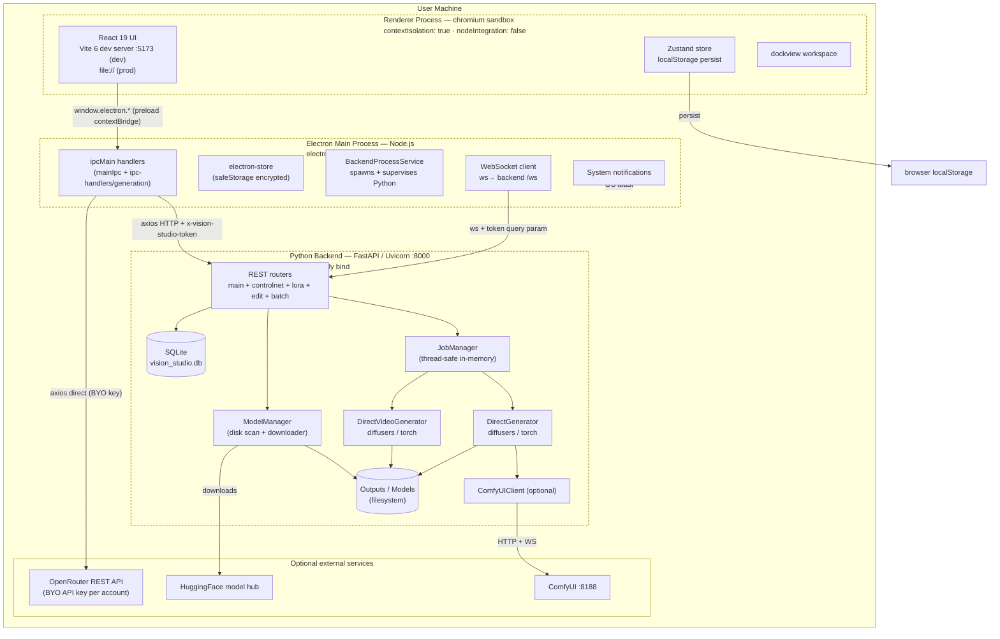
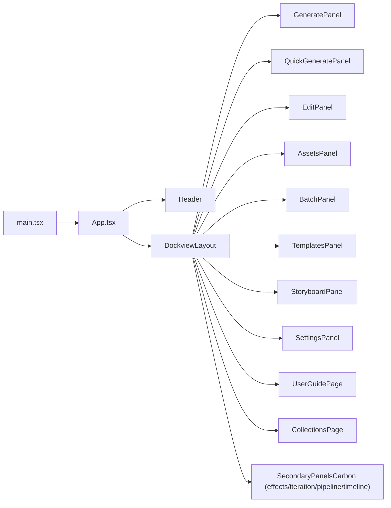
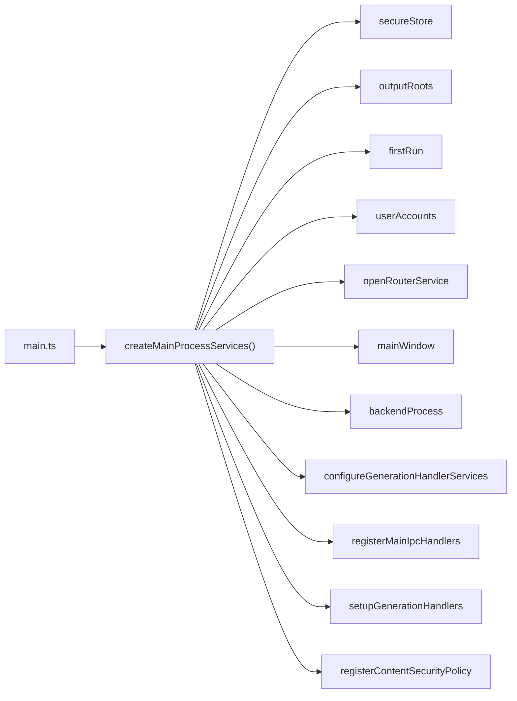
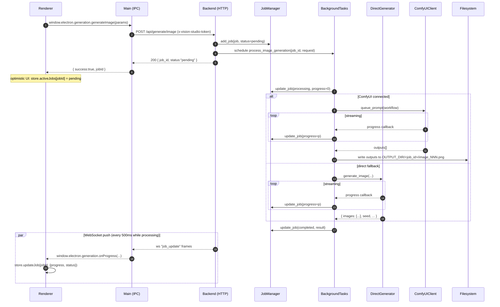
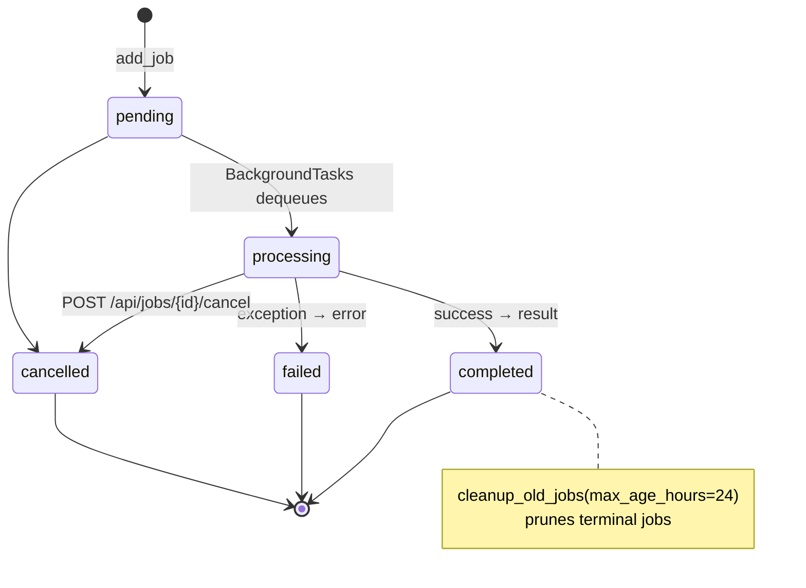
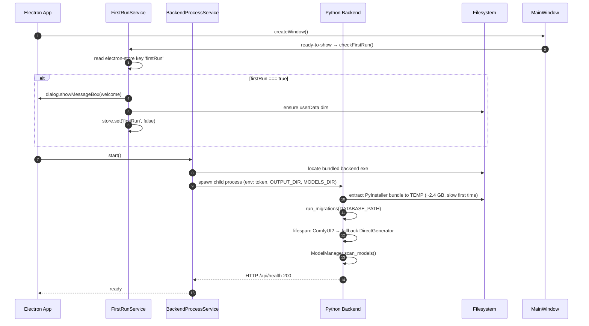
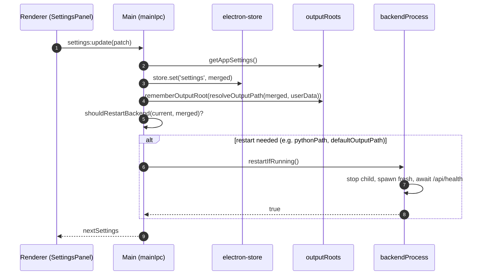
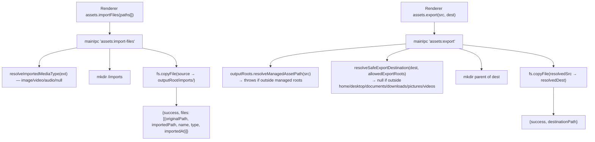
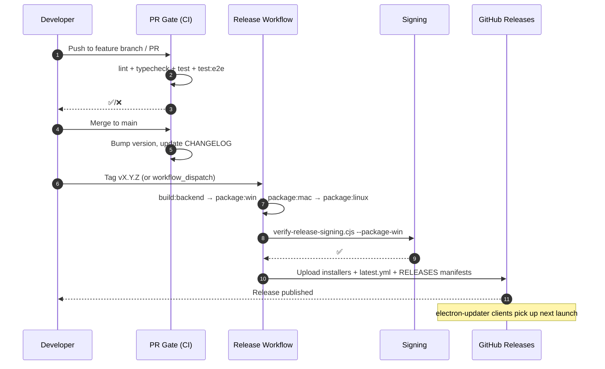

# Vision Studio — System Architecture

> Version: tracks `package.json` (currently **2.5.0**)
> Audience: contributors, integrators, security reviewers
> Companion docs: [`API_ENDPOINTS.md`](./API_ENDPOINTS.md), [`DATABASE_SCHEMA.md`](./DATABASE_SCHEMA.md), [`api/openapi.json`](./api/openapi.json)

Vision Studio is a local-first, Electron-shelled desktop app that drives an out-of-process Python (FastAPI + PyTorch) backend for AI image and video generation. This document is the canonical map of how the three processes are wired together, where state lives, and where the trust boundaries are.

---

## 1. Process model



Three OS processes, never co-mingled:

| Process | Runtime | Trust | Lifetime |
|---------|---------|-------|----------|
| **Renderer** | Chromium + V8 (sandboxed) | UNTRUSTED — handles user input | per `BrowserWindow` |
| **Main** | Node.js (Electron 33) | TRUSTED — file system, OS, processes | app lifetime |
| **Backend** | CPython 3.10+ (PyInstaller-frozen in prod) | TRUSTED — GPU, torch, downloads | child of Main; auto-restart on settings change |

The renderer never opens a TCP socket. All renderer→backend traffic is brokered through `ipcMain.handle(...)` in the Main process.

---

## 2. Source layout

```
vision-studio/
├── electron/                        # Main + preload (TypeScript, ESM)
│   ├── main.ts                      # Bootstrap: createMainProcessServices + lifecycle
│   ├── preload.ts                   # contextBridge.exposeInMainWorld('electron', …)
│   ├── ipc-guard.ts                 # Loaded FIRST — guards ipcMain registrations
│   ├── ipc-handlers/
│   │   └── generation.ts            # Backend proxy + OpenRouter image fan-out
│   └── services/                    # Composable main-process services (DI)
│       ├── mainProcess.ts           # Composition root
│       ├── mainIpc.ts               # Most ipcMain.handle(...) registrations
│       ├── mainWindow.ts            # BrowserWindow lifecycle
│       ├── backendProcess.ts        # spawn/restart/health-check Python
│       ├── backendAuth.ts           # x-vision-studio-token mint + headers
│       ├── secureStore.ts           # electron-store + safeStorage wrapper
│       ├── outputRoots.ts           # Managed output dir whitelist
│       ├── settings.ts              # AppSettings + restart triggers
│       ├── userAccounts.ts          # Multi-account preferences (OpenRouter etc.)
│       ├── openRouter.ts            # OpenRouter API client
│       ├── security.ts              # URL/path/store-key validation
│       ├── contentSecurityPolicy.ts # CSP header injection
│       └── firstRun.ts              # Onboarding dialog
│
├── backend/                         # Python FastAPI server
│   ├── main.py                      # FastAPI app, lifespan, REST + WS
│   ├── api/                         # APIRouters mounted under /api/v1/*
│   │   ├── controlnet.py
│   │   ├── lora.py
│   │   ├── edit.py
│   │   └── batch.py
│   ├── schemas/                     # Pydantic request/response models
│   ├── services/                    # Domain services (controlnet/lora/edit/batch)
│   ├── middleware/rate_limit.py     # slowapi limiter + handler
│   ├── db/
│   │   ├── migrate.py               # version-numbered migration runner
│   │   ├── schema_version.py        # SCHEMA_VERSION constant + r/w
│   │   └── migrations/001_initial_schema.py
│   ├── utils/                       # job_manager, model_manager, comfy_*,
│   │                                # direct_generator, direct_video_generator,
│   │                                # image_ops, prompt_service, sanitization
│   ├── tests/                       # unittest suites (28 active + 7 skipped)
│   ├── requirements.txt
│   └── main.spec                    # PyInstaller spec
│
├── src/                             # React renderer (TypeScript)
│   ├── App.tsx                      # Top-level shell + global keybinds
│   ├── main.tsx                     # ReactDOM.createRoot
│   ├── pages/                       # One panel per workspace tab
│   ├── components/                  # ~20 component categories (canvas, edit, …)
│   ├── features/                    # Domain logic per area (assets, generate, …)
│   ├── store/
│   │   ├── appStore.ts              # Zustand root store (slices composed)
│   │   ├── appStore.types.ts        # AppState shape
│   │   └── slices/                  # 13 feature slices
│   ├── hooks/                       # Cross-cutting hooks
│   ├── types/                       # Domain TypeScript types
│   └── utils/
│
├── tests/                           # Vitest integration + Playwright E2E
└── docs/                            # ← you are here
```

---

## 3. Frontend (renderer)

### 3.1 Stack

| Layer | Choice | Notes |
|-------|--------|-------|
| Framework | **React 19** | Concurrent renderer, function components only |
| Build | **Vite 6** + `@vitejs/plugin-react` | HMR in dev; static `dist/` in prod |
| Routing | **react-router-dom 7** | Used inside the dockview workspace |
| Workspace | **dockview 5** | Resizable, dockable panels for the studio |
| State | **Zustand 5** + `useShallow` | One root store; sliced by feature |
| Persist | `zustand/middleware/persist` → `localStorage` | Whitelisted, capped slices (see below) |
| Styling | **Tailwind CSS v4** + `tailwind-merge` | Token-driven theme, dark/light/system |
| Anim | **Framer Motion 12** | Reduced-motion friendly |
| Drag | `@dnd-kit/core` + `@dnd-kit/sortable` | Timeline + asset library |
| Canvas | **Konva** + **react-konva** | Edit panel canvas + transforms |
| Virtual | `@tanstack/react-virtual` | Asset grids + timeline tracks |
| Floating | `@floating-ui/react` | Tooltips, popovers, menus |
| Icons | **lucide-react** | Stroke-only icon set |
| Net | **axios 1** | Used in `electron/` only — renderer talks via IPC |

### 3.2 State architecture

`src/store/appStore.ts` composes 13 slices into one Zustand store:

| Slice | Owns |
|-------|------|
| `uiSlice` | Tabs, modes, sidebars, theme preference, dock layout |
| `projectSlice` | Active `Project`, scenes, characters, region locks |
| `generationSlice` | Active jobs, queue, drafts, batch results, asset library |
| `generationPreviewSlice` | Live preview frames, comparison state |
| `editSlice` | Layers, history, image adjustments (undo/redo) |
| `iterationSlice` | Iteration nodes/branches/comparison |
| `collectionsSlice` | Collections, smart queries, tagging mode |
| `mediaTimelineSlice` | Imported media + retake takes |
| `pipelineSlice` | Multi-step generation pipelines + executions |
| `promptStudioSlice` | Prompt templates + composition layers |
| `timelineSlice` | Sequences, tracks, clips, transitions, beats |
| `workflowSlice` | Workflow graph + runs |

Persistence is opt-in per field (see `appStore.ts` `partialize`) and capped — e.g. `promptHistory.slice(0, 50)`, `assetLibrary.slice(0, 500)`. This prevents `localStorage` blowup as users iterate on prompts.

### 3.3 Renderer ↔ main contract

The renderer NEVER imports `electron`, `fs`, `path`, or `child_process`. It only sees `window.electron`, defined in `electron/preload.ts` and exposed via `contextBridge.exposeInMainWorld('electron', electronAPI)`. The `ElectronAPI` TypeScript interface is the single source of truth — every IPC channel has a matching method here.

Top-level namespaces on `window.electron`:

- `app` — version, paths, open external/path
- `dialog` — folder/media/save pickers
- `store` — generic key/value (whitelisted by `isAllowedStoreKey`)
- `settings` — typed `AppSettings` get/update/reset
- `accounts` + `openrouter` — multi-account preferences and OpenRouter API client
- `assets` — import/export/delete/reveal/clear-cache
- `generation` — image/video/timeline/batch/enhance/crop/upscale/extract + status/cancel/list/onProgress
- `system` — GPU + backend info (one call combines both)
- `models` — list/download/status/delete
- `notifications` — `notify(type, payload)` (gated by user settings)
- `backend` — start/stop/status/checkBundled + onStatusChange

`onProgress` and `onStatusChange` are the only push channels — they wrap `ipcRenderer.on(...)` and return an unsubscribe function.

### 3.4 Top-level UI flow



`App.tsx` wires three lifecycle effects:

1. **Global keybinds** — `?` toggles `KeyboardShortcuts` overlay; Ctrl/Cmd+Z and Ctrl/Cmd+Y route to `appStore.undo()` / `redo()`.
2. **System info polling** — calls `electron.system.getInfo()` and `electron.backend.getStatus()` on mount, then every 30 s, plus an event subscription so a backend restart triggers an immediate refresh.
3. **Generation progress** — subscribes to `electron.generation.onProgress`; each push calls `updateJob(jobId, {progress, status})`.

---

## 4. Main process (Electron)

### 4.1 Composition root

`electron/main.ts` is intentionally thin (45 LOC). It instantiates `createMainProcessServices(...)` from `electron/services/mainProcess.ts`, which wires every collaborator:



This dependency-injected design is what keeps every `services/*.ts` testable in isolation — see the `*.test.ts` files alongside each service.

### 4.2 IPC contract

Two registration sites:

1. **`mainIpc.ts`** — app, dialog, store, settings, accounts, openrouter, assets, notifications, system, backend, app:get-path. ~30 channels.
2. **`ipc-handlers/generation.ts`** — generation, models, plus the OpenRouter image fan-out and the WebSocket client. ~17 channels and one push event (`generation:progress`).

`electron/ipc-guard.ts` is loaded **first** in `main.ts` — before any module that may register an `ipcMain.handle`. It rejects duplicate handler registration so a stale or stray handler can never silently shadow the real one. This is one of the rare cases in this codebase where load order is load-bearing; do not move that import.

### 4.3 Backend supervision

`backendProcess.ts` is the single owner of the Python child process:

- In **dev**, spawns `python backend/main.py` against the system venv.
- In **prod**, spawns the PyInstaller-frozen exe extracted from `extraResources` (path: `backendProcess.getBundledBackendPath()`).
- Mints a per-launch auth token via `backendAuth.ts`, sets it as `VISION_STUDIO_BACKEND_AUTH_TOKEN` in the child env, and passes it on every HTTP and WebSocket request via the `x-vision-studio-token` header (HTTP) or `?token=…` query (WS). The token never reaches the renderer.
- Polls `/api/health` to determine readiness; surfaces a friendly modal if the backend fails to start.
- Restarts on settings changes that affect backend behavior (`shouldRestartBackend(prev, next)` in `settings.ts`).
- Kills the child on `window-all-closed` and `before-quit` to guarantee no orphaned Uvicorn process.

### 4.4 Trust boundary enforcement

`security.ts`:

| Function | Purpose |
|----------|---------|
| `isSafeExternalUrl(url)` | Whitelist `http(s)`/`mailto`; rejects `javascript:`, `file:`, custom schemes |
| `isAllowedStoreKey(key)` | Whitelists `recentProjects`, `settings`, `firstRun`, `modelsDownloaded`, `managedOutputRoots`, `userAccounts` |
| `resolveSafeExportDestination(dest, allowedRoots)` | Confines export targets to home/desktop/documents/downloads/pictures/videos |
| `toSafeRendererError(error, fallback)` | Strips paths, stack traces, and tokens before returning errors to the renderer |

`outputRoots.ts`:

| Function | Purpose |
|----------|---------|
| `resolveManagedAssetPath(assetPath)` | Resolves `/outputs/...` and bare paths against the managed output roots; throws if escaping |
| `getManagedOutputRoots()` | Returns the set of accepted roots: bundled outputs dir + user-configured + remembered |
| `rememberOutputRoot(root)` | Records a new managed root after a settings change so old assets remain reachable |

Every renderer-supplied path passes through `resolveManagedAssetPath` (read) or `resolveSafeExportDestination` (write) before any `fs.*` call.

`secureStore.ts` wraps `electron-store` with `safeStorage.encryptString` for sensitive fields (e.g. OpenRouter API keys), falling back to plaintext storage with a logged warning if the OS keychain is unavailable.

### 4.5 OpenRouter integration

`openRouter.ts` is a typed client for the [OpenRouter](https://openrouter.ai) REST API. It supports two routes:

- **Prompt enhancement / negative-prompt suggestion** — used when the active account's `promptEnhancementProvider === 'openrouter'`.
- **Still-image generation** — used when `imageGenerationProvider === 'openrouter'`. Generated images are written to `<outputRoot>/openrouter/YYYY-MM-DD/<jobId>-<n>.<ext>` and surfaced as if they came from a local job.

OpenRouter jobs run **entirely in the Main process**. They get their own job IDs (`openrouter-image-<uuid>`), their own in-memory map (`openRouterImageJobs`), and they emit `generation:progress` events themselves — the renderer cannot tell whether a job is local or routed. The Python backend is bypassed for these flows.

If the OpenRouter account is misconfigured for a particular request (no key, no model, ControlNet/inpaint inputs which OpenRouter doesn't support yet) the handler returns a structured `{ success: false, error }` rather than failing silently.

---

## 5. Backend (FastAPI + PyTorch)

### 5.1 App composition

`backend/main.py` builds the FastAPI app at import time:

```python
app = FastAPI(
    title="Vision Studio API",
    version="0.1.0",
    docs_url="/api/docs",
    redoc_url="/api/redoc",
    openapi_url="/api/openapi.json",
    lifespan=lifespan,
)

app.state.limiter = limiter                                # slowapi
app.add_exception_handler(RateLimitExceeded, rate_limit_exceeded_handler)

@app.middleware("http")
async def require_local_auth_token(request, call_next): ...   # x-vision-studio-token

@app.middleware("http")
async def log_requests(request, call_next): ...               # request_id + duration

app.add_middleware(CORSMiddleware,
    allow_origins=["http://localhost:5173", "http://127.0.0.1:5173"], ...)

app.mount("/outputs", StaticFiles(directory=OUTPUT_DIR), name="outputs")

app.include_router(controlnet_router)   # /api/v1/controlnet/*
app.include_router(lora_router)         # /api/v1/lora/*
app.include_router(edit_router)         # /api/v1/edit/*
app.include_router(batch_router)        # /api/v1/batch/*
```

Notable invariants:

- **Bind address**: Uvicorn listens on `0.0.0.0:8000`, but Electron only ever connects to `127.0.0.1`. If you change the bind, also update the firewall/CSP story — the assumption "only this machine talks to this backend" is load-bearing.
- **Auth**: When `VISION_STUDIO_BACKEND_AUTH_TOKEN` is set (always set by Electron in prod), every request must carry `x-vision-studio-token: <token>`. Exempt paths: `/`, `/api/health`, `/api/docs`, `/api/redoc`, `/api/openapi.json`, `/outputs/*`. The WebSocket accepts the token as a query parameter and closes with code 1008 on mismatch.
- **CORS**: Restricted to the Vite dev origins only. Production renderer uses the `file://` protocol and goes through Electron-proxied IPC, so it never appears as a browser origin.
- **Rate limiting**: `slowapi` limiter, keyed by client IP. Categories: `generate` 10/min, `edit` 30/min, `batch` 5/min, `default` 60/min.
- **Static serving**: `/outputs/*` is mounted directly so the renderer can render generated assets via `` without a separate IPC round-trip.

### 5.2 Generation pipeline (image)



Notes:

- **ComfyUI is optional.** If the `ComfyUIClient` import fails or `connect()` fails at startup, `comfy_client` stays `None` and every job goes through `DirectGenerator`. Both paths are tested.
- **Outputs are namespaced by `job_id`** so concurrent jobs cannot collide on filenames.
- **Seed handling**: `-1` is a sentinel meaning "random" and gets resolved (and reported) by the generator so the user can re-roll deterministically.

### 5.3 Generation pipeline (video)

Same shape as image, but:

- Always uses `DirectVideoGenerator` (no ComfyUI fallback yet).
- Output is one MP4 per job (via `imageio` writers); no per-frame static files.
- Typical durations 2–10 minutes depending on resolution, fps, steps, and GPU.

### 5.4 Timeline export

`POST /api/timeline/export` is a different beast. The renderer resolves which clips contribute to which output frames, then submits the **fully resolved** frame stream + audio plan. The backend:

1. Renders each frame as an RGB PIL image (compositing layers via `Image.alpha_composite`, fitting via `Image.thumbnail`, applying per-layer opacity).
2. Encodes the frame stream into an MP4 via `imageio.get_writer(output_path, fps=...)`.
3. If `audio_layers` is non-empty, writes an intermediate `*-silent.mp4`, then runs `ffmpeg` (via `imageio_ffmpeg.get_ffmpeg_exe()`) with a generated `-filter_complex` graph that:
   - `atrim`s each source by `source_time_ms` + `duration_ms`,
   - normalizes PTS,
   - applies fade-in/out via a piecewise `volume=` expression,
   - delays via `adelay`,
   - and either passes through (1 audio layer) or `amix`es (2+) into the final track.
4. Mux is `-c:v copy -c:a aac -b:a 192k -movflags +faststart` for fast scrubbing in viewers.

The job is registered in `JobManager` and reports progress via the same WebSocket channel (renderer poll/streaming reads via `generation:progress`). Failures are surfaced through `update_job(status=FAILED, error=...)` rather than an HTTP error — the HTTP request only kicks off the background task.

### 5.5 Job lifecycle



The current `JobManager` is **in-memory only** — a `Dict[str, GenerationJob]` guarded by a `threading.Lock`. Restarting the backend wipes job state. The `jobs` SQLite table exists (see [`DATABASE_SCHEMA.md`](./DATABASE_SCHEMA.md)) but is not yet wired to the manager; persisting through restarts is a known follow-up.

### 5.6 Module-level routers

Each `/api/v1/*` router lives in `backend/api/<area>.py`, depends on a Pydantic schema in `backend/schemas/<area>.py`, and delegates to a service in `backend/services/<area>_service.py`.

| Router | Tag | Service | Notes |
|--------|-----|---------|-------|
| `controlnet.py` | `ControlNet` | `ControlNetService` | 8 control modes (canny, depth, normal, openpose, segmentation, mlsd, lineart, softedge); base64 in/out |
| `lora.py` | `LoRA` | `LoRAService` | LoRA mixer over any base model; scale 0–2; safetensors / .pt |
| `edit.py` | `Edit` | `EditService` | rembg (BG), Real-ESRGAN (2x/4x/8x), GFPGAN (face restore) |
| `batch.py` | `Batch` | `BatchService` | ZIP export, format conversion (png/jpg/webp), optional resize |

Every router uses `slowapi`'s `@limiter.limit(LIMITS["..."])` and converts service exceptions into structured `{error, error_code}` HTTPExceptions.

### 5.7 Sanitization

`backend/utils/sanitization.py` provides:

| Function | Used for |
|----------|----------|
| `sanitize_prompt(text)` | All user-supplied text prompts |
| `sanitize_path(path)` | Path-traversal prevention on `image_id` parameters in batch |
| `validate_base64(data)` | Sanity-check base64 image inputs to controlnet/edit before passing to PIL |

Even though the backend is local-only, these are non-optional — a malicious renderer extension or a hijacked OpenRouter response could otherwise feed unsanitized data straight into `PIL.Image.open` or the filesystem.

---

## 6. Data flows

### 6.1 First launch



Why this matters: the first launch can take **several minutes** because PyInstaller has to extract the bundle to `%TEMP%`. The Main process surfaces a "Backend Not Started" dialog with a hint about extraction time if the readiness probe times out — do not race past it.

### 6.2 Settings update with backend restart



`shouldRestartBackend` returns `true` only when a setting actually affects backend behavior — purely cosmetic settings (theme) skip the restart. Renderers receive the merged settings synchronously from the IPC reply.

### 6.3 Asset import vs export (security paths)



Key invariant: **read paths are confined to managed output roots** and **write paths are confined to OS user directories**. Cross-direction escapes return structured errors rather than throwing; the renderer treats both as recoverable.

---

## 7. Persistence

State is split across **four** stores. Knowing where each lives is essential.

| Store | Backed by | Owner | Lifetime | Examples |
|-------|-----------|-------|----------|----------|
| **Renderer Zustand persist** | `localStorage` | Renderer | Per-window-profile | UI prefs, prompt history (capped 50), custom style presets, recent projects, batch results (capped 200), asset library cache (capped 500) |
| **electron-store** | JSON file in `userData` (sensitive fields encrypted via `safeStorage`) | Main | Per-OS-user-install | App settings, recent projects, first-run flag, downloaded models registry, managed output roots, **multi-account preferences and OpenRouter API keys** |
| **In-memory `JobManager`** | Python dict + lock | Backend | Per-backend-process | Active and recent jobs, progress, results |
| **SQLite (`vision_studio.db`)** | File in `<userData>/data/vision_studio.db` | Backend | Per-OS-user-install | `images`, `jobs`, `settings`, `schema_version` (see [`DATABASE_SCHEMA.md`](./DATABASE_SCHEMA.md)). Schema is provisioned by migrations but **most fields are not yet populated by the running app** — they exist for future job-history persistence. |

**Filesystem state** sits underneath all of this:

| Path | Created by | Contains |
|------|------------|----------|
| `<userData>/output/` | Backend (default `OUTPUT_DIR`) | `<job_id>/image_NNN.png`, video MP4s, derivative crops/upscales/frames |
| `<userData>/output/imports/` | Main (`assets:import-files`) | User-imported media |
| `<userData>/output/openrouter/YYYY-MM-DD/` | Main (OpenRouter image fan-out) | Images returned by OpenRouter |
| `<userData>/models/` | Backend (`ModelManager`) | Downloaded model weights (multi-GB) |
| `<userData>/data/vision_studio.db` | Backend (migrations) | SQLite database |

---

## 8. Security model

### 8.1 Trust hierarchy

| Layer | Trust | Hardening |
|-------|-------|-----------|
| Renderer | Untrusted — arbitrary user input, web technology | `contextIsolation: true`, `nodeIntegration: false`, no remote module, CSP via `contentSecurityPolicy.ts` |
| Preload | Mediator | Exposes ONLY the typed `electron` namespace; no `process`, `require`, or `electron` re-exports |
| Main | Trusted | Path/URL/store-key validation on every untrusted input; uses `fs.promises` not sync APIs |
| Backend | Trusted | Localhost-only; per-launch token; Pydantic validation; rate-limited; sanitized inputs |

### 8.2 Threat model summary

| Threat | Mitigation |
|--------|------------|
| Malicious paths in IPC (`../../etc/passwd`) | `resolveManagedAssetPath` + `resolveSafeExportDestination` confine I/O |
| Malicious `open-external` URL | `isSafeExternalUrl` whitelist |
| Malicious store key write | `isAllowedStoreKey` whitelist |
| Local user runs another HTTP client against `:8000` | `x-vision-studio-token` per-launch auth (the renderer learns the token only via IPC headers prepared by Main) |
| OpenRouter key disclosure | Stored encrypted via OS keychain; never returned to the renderer in plaintext |
| Backend stack traces leaking to renderer | `toSafeRendererError` strips paths/stacks; Pydantic + `HTTPException` deliver structured errors |
| FFmpeg shell injection (timeline export) | Audio command built as `argv` array with `subprocess.run(check=True, capture_output=True)` — no shell |
| Rate-limit-bypassed expensive endpoints | `slowapi` `@limiter.limit` on every router; defaults are per-IP, conservative for a single-user box |
| Migration data loss | Migrations are append-only, version-numbered; runner stops on first failure |

### 8.3 Files to read for security work

- `electron/services/security.ts` — URL/path/key validators
- `electron/services/outputRoots.ts` — managed roots
- `electron/services/secureStore.ts` — `safeStorage` fallback behavior
- `electron/services/contentSecurityPolicy.ts` — CSP headers
- `backend/middleware/rate_limit.py` — limiter
- `backend/utils/sanitization.py` — text/path/base64 validators
- `backend/main.py` — auth middleware (`require_local_auth_token`)
- `SECURITY-AUDIT-2026-04-18.md` (root) — most recent audit findings

---

## 9. Build, packaging, distribution

| Stage | Tool | Output | Notes |
|-------|------|--------|-------|
| Backend build | PyInstaller (`build-backend.cjs` → `backend/main.spec`) | `backend/dist/VisionStudio-Backend.exe` (~2.4 GB) | One-file mode; PyInstaller extracts to `%TEMP%` on first run |
| Renderer build | Vite | `dist/index.html` + assets | Hashed file names; Tailwind purged to used classes |
| Main build | `vite-plugin-electron` | `dist-electron/main.mjs`, `dist-electron/preload.mjs` | ESM; preload remapped to `.cjs` if needed by the platform |
| Packaging | electron-builder (`electron-builder.yml`, `electron-builder.windows.json`) | NSIS installer + portable + MSI; `extraResources` copies the backend exe | Code-signing handled by `scripts/verify-release-signing.cjs` |
| Test gates | Vitest, Playwright, Python `unittest` | CI artefacts + JUnit | See `package.json` `test:*` scripts |
| Lint gates | ESLint (`--max-warnings=0`), `tsc --noEmit` | — | Both wired in `pr-gate.yml` |

### Production layout (Windows example)

```
%LOCALAPPDATA%\Programs\Vision Studio\
├── Vision Studio.exe               ← Electron shell
├── resources\
│   ├── app.asar                    ← compiled main + renderer
│   └── VisionStudio-Backend.exe    ← PyInstaller bundle (extraResources)
└── ...

%APPDATA%\vision-studio\           ← per-user state
├── config.json                     ← electron-store
├── output\                         ← OUTPUT_DIR
├── models\                         ← MODELS_DIR
└── data\
    └── vision_studio.db
```

---

## 10. Testing strategy

| Layer | Framework | Files | Tests | Notes |
|-------|-----------|-------|-------|-------|
| Unit + integration | Vitest 3 | 16 | 119 | Pure logic, store, Electron services with happy-dom mocks |
| Component | Vitest + Testing Library | (overlaps above) | — | jsdom; covers React panels |
| E2E | Playwright + Electron | 3 | 13 | Headed/headless; spawns built app |
| Accessibility | `@axe-core/playwright` | (within E2E) | smoke | `npm run test:a11y` |
| Backend | unittest | 7 | 35 (28 + 7 skipped) | `backend/tests`; some skipped without GPU |

CI gates fail if:

- `npm run lint` reports any warning (max-warnings=0)
- `npm run typecheck` finds any TypeScript error
- `npm test` (Vitest) has any failing test
- `npm run test:e2e` regresses on the smoke suite
- `npm run release:signing:check` rejects an unsigned binary

---

## 11. Deployment / release flow



Local rehearsal: `npm run test:build` (= `build:windows` + a sanity message).

---

## 12. Operational reference

| Task | Command |
|------|---------|
| Dev (renderer + main + system Python backend) | `npm run dev` |
| Run backend manually | `cd backend && python main.py` |
| Build Python bundle | `npm run build:backend` |
| Package signed Windows installer | `npm run package:signed` |
| Run all Vitest | `npm test` |
| Backend tests | `cd backend && python -m unittest discover -s tests -v` |
| E2E (requires built app) | `npm run build && npm run test:e2e` |
| Type check | `npm run typecheck` |
| Lint | `npm run lint` |
| Clean (preserve venv) | `npm run clean` |
| Clean (purge venv + node_modules) | `npm run clean:all` |

---

## 13. Where to start as a new contributor

1. **Read this doc end-to-end.** Then [`API_ENDPOINTS.md`](./API_ENDPOINTS.md) and [`DATABASE_SCHEMA.md`](./DATABASE_SCHEMA.md).
2. **Wire the dev loop:** `npm install && setup-python.bat && npm run dev`.
3. **Open a panel and trace one feature end-to-end.** A great first read is the image-generation flow:
   - `src/pages/GeneratePanel.tsx` (entry point UI)
   - `src/store/slices/generationSlice.ts` (action + state)
   - `electron/preload.ts` → `electron.generation.generateImage`
   - `electron/ipc-handlers/generation.ts` → `generation:generate-image` handler
   - `backend/main.py` → `POST /api/generate/image` → `process_image_generation` → `DirectGenerator`
4. **Run the relevant tests** for whatever you change. CI will not be merciful.
5. **Update this doc** if your change moves a boundary — modules, processes, or stores.

---

_Last verified against the codebase on 2026-05-03. Canonical source: `package.json` v2.5.0, `backend/main.py`, `electron/services/mainProcess.ts`, `electron/preload.ts`, `backend/db/migrations/001_initial_schema.py`._
