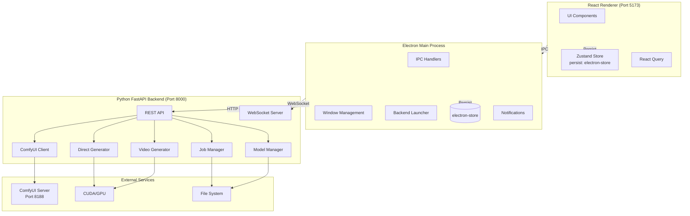
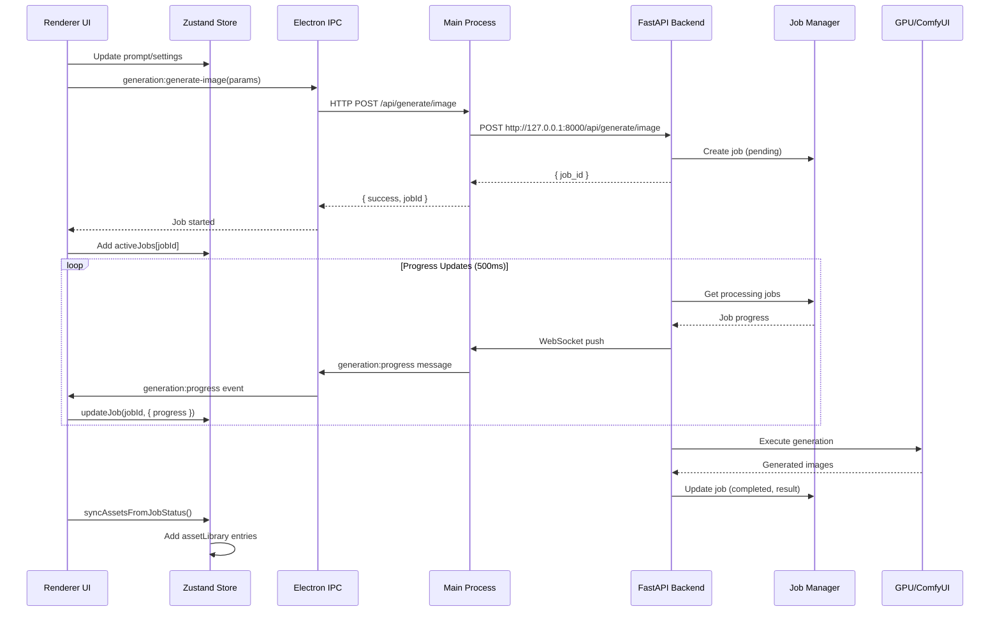
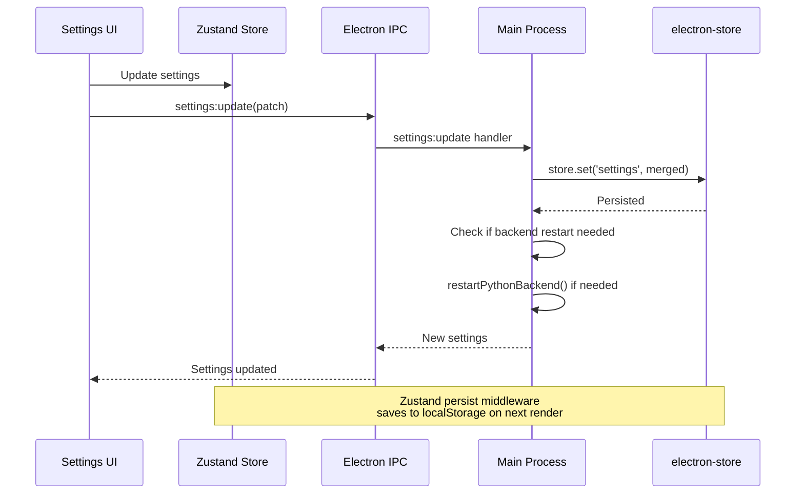
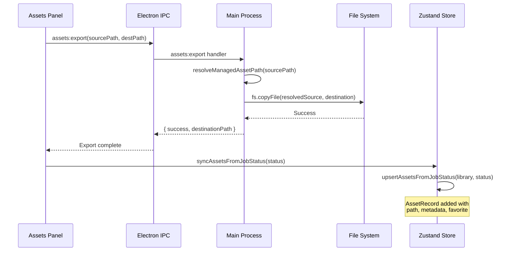
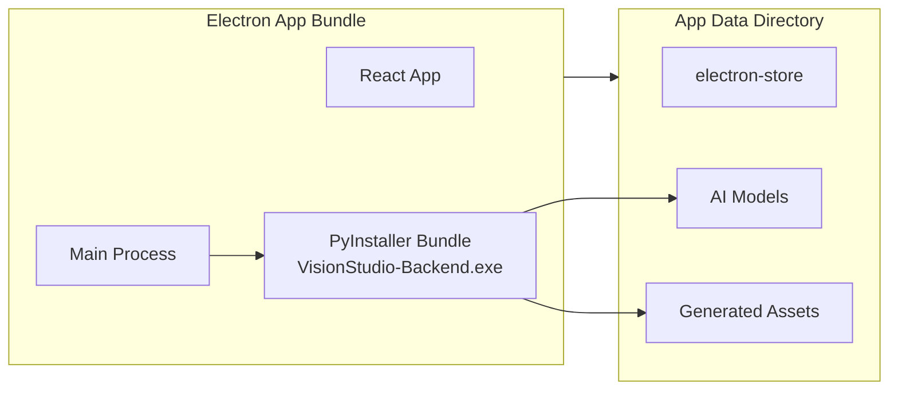

# Vision Studio Architecture

## Overview

Vision Studio is a desktop Electron application with a three-tier architecture separating concerns between the React renderer, Electron main process, and Python FastAPI backend.



## Architecture Layers

### 1. Renderer Process (React + Vite)

**Port:** 5173 (Vite dev server)  
**Location:** `src/`

**Responsibilities:**
- UI rendering and user interactions
- Local state management via Zustand
- Server state caching via React Query
- Asset library management
- Generation job monitoring

**Key Components:**
- `src/store/appStore.ts` — Global state with persistence
- `src/components/` — UI component library
- `src/pages/` — Feature panels (Generate, Edit, Assets, Settings)
- `src/features/` — Domain-specific logic

**State Persistence:**
```typescript
// Zustand persist middleware saves to localStorage
persist(useAppStore, {
  name: 'vision-studio-storage',
  partialize: (state) => ({
    sidebarCollapsed: state.sidebarCollapsed,
    darkMode: state.darkMode,
    recentProjects: state.recentProjects,
    promptHistory: state.promptHistory.slice(0, 50),
    customStylePresets: state.customStylePresets,
    userTemplates: state.userTemplates,
    batchResults: state.batchResults.slice(0, 200),
    assetLibrary: state.assetLibrary.slice(0, 500),
  }),
})
```

### 2. Electron Main Process

**Location:** `electron/`

**Responsibilities:**
- Window lifecycle management
- IPC handler registration
- Python backend process control
- File system access (sandboxed)
- System notifications
- Settings persistence (electron-store)

**Key Files:**
- `electron/main.ts` — Entry point, IPC handlers, backend launcher
- `electron/preload.cjs` — Secure bridge between renderer and main
- `electron/ipc-handlers/generation.ts` — Backend proxy handlers

**IPC Handlers:**
| Handler | Description |
|---------|-------------|
| `app:get-version` | Return app version |
| `app:open-external` | Open URL in default browser |
| `app:open-path` | Open file/folder in OS explorer |
| `dialog:select-folder` | Folder picker dialog |
| `dialog:save-file` | Save file dialog |
| `store:get/set/reset` | electron-store access |
| `settings:get/update/reset` | App settings management |
| `assets:export/delete/reveal` | Asset file operations |
| `notifications:notify` | System notifications |
| `backend:start/stop/status` | Backend process control |
| `generation:*` | Proxy to Python backend |
| `models:*` | Model management proxy |
| `system:get-info` | System capabilities |

**Trust Boundary:**
```
┌─────────────────────────────────────────────────────┐
│                  UNTRUSTED (Renderer)               │
│  - User input, arbitrary URLs                       │
│  - No direct file system access                     │
│  - contextIsolation: true, nodeIntegration: false   │
└─────────────────────────────────────────────────────┘
                          │
                          ▼ IPC (validated)
┌─────────────────────────────────────────────────────┐
│               TRUSTED (Main Process)                │
│  - File system operations (validated paths)         │
│  - Process spawning (Python backend)                │
│  - electron-store (settings persistence)            │
│  - System notifications                             │
└─────────────────────────────────────────────────────┘
```

### 3. Python Backend (FastAPI)

**Port:** 8000 (HTTP), WebSocket on `/ws`  
**Location:** `backend/`

**Responsibilities:**
- AI model management
- Image/video generation
- Job queue management
- ComfyUI integration
- Real-time progress updates

**Key Modules:**
- `backend/main.py` — FastAPI app, REST endpoints, WebSocket
- `backend/utils/job_manager.py` — Async job queue
- `backend/utils/model_manager.py` — Model download/install
- `backend/utils/comfy_workflows.py` — ComfyUI workflow builder
- `backend/utils/direct_generator.py` — Diffusers fallback
- `backend/utils/direct_video_generator.py` — Video generation
- `backend/utils/prompt_service.py` — Prompt enhancement

**REST API Endpoints:**
| Endpoint | Method | Description |
|----------|--------|-------------|
| `/api/generate/image` | POST | Start image generation |
| `/api/generate/video` | POST | Start video generation |
| `/api/jobs/{id}` | GET | Get job status |
| `/api/jobs/{id}/cancel` | POST | Cancel job |
| `/api/jobs` | GET | List jobs |
| `/api/models` | GET | List available models |
| `/api/models/{id}/download` | POST | Download model |
| `/api/models/{id}/status` | GET | Get download progress |
| `/api/models/{id}` | DELETE | Delete model |
| `/api/prompts/enhance` | POST | AI prompt enhancement |
| `/api/images/crop` | POST | Crop/transform image |
| `/api/images/upscale` | POST | AI upscale image |
| `/api/system/info` | GET | GPU/system info |
| `/ws` | WebSocket | Real-time job updates |

**WebSocket Protocol:**
```
Client → Server: { "action": "subscribe", "job_id": "..." }
Server → Client: { "type": "job_update", "job_id": "...", "status": "...", "progress": 45.5 }
```

## Data Flows

### Image Generation Flow



### Settings Persistence Flow



### Asset Management Flow



## Security Model

### Trust Boundaries

1. **Renderer (Untrusted)**
   - No direct file system access
   - No direct backend access (must go through IPC)
   - `contextIsolation: true`
   - `nodeIntegration: false`
   - `sandbox: false` (required for preload)

2. **Main Process (Trusted)**
   - Validates all IPC input
   - Path validation via `isPathInsideRoots()`
   - Controls backend process lifecycle
   - Manages electron-store

3. **Python Backend (Trusted)**
   - Localhost-only binding (127.0.0.1)
   - CORS restricted to Electron origins
   - No authentication (local deployment assumed)

### Path Security

```typescript
// Main process validates all asset paths
function resolveManagedAssetPath(assetPath: string) {
  const resolvedPath = resolveAssetPathFromRoots(
    assetPath,
    getResolvedOutputDirectory(),
    getManagedOutputRoots(),
    (candidatePath) => fs.existsSync(candidatePath)
  );
  if (!isPathInsideRoots(resolvedPath, getManagedOutputRoots())) {
    throw new Error('Asset path is outside managed output directories');
  }
  return resolvedPath;
}
```

## Deployment Architecture



**Production Build:**
- Frontend: Vite build → `dist/`
- Main: Electron build → `dist-electron/`
- Backend: PyInstaller one-file → `backend/dist/VisionStudio-Backend.exe`
- extraResources copies backend to `resources/` in ASAR

**First Run:**
1. PyInstaller extracts ~2.4GB to temp directory
2. Backend starts, scans for models
3. Models download on-demand to `userData/models/`
4. Outputs saved to `userData/outputs/` or user-configured path

## Technology Stack

| Layer | Technology | Purpose |
|-------|------------|---------|
| Renderer | React 19 | UI framework |
| | Vite | Build tool, dev server |
| | TypeScript | Type safety |
| | Tailwind CSS v4 | Styling |
| | Zustand | State management |
| | Framer Motion | Animations |
| | @dnd-kit | Drag-and-drop |
| Main | Electron | Desktop runtime |
| | electron-store | Settings persistence |
| Backend | Python 3.x | Runtime |
| | FastAPI | REST API framework |
| | Uvicorn | ASGI server |
| | PyTorch | Deep learning |
| | Diffusers | Image generation |
| | ComfyUI | Workflow engine (optional) |
| | OpenCV | Image operations |
