# Vision Studio — Diagram Library

> Standalone Mermaid sources for embedding in slides, talks, or other docs.
> The same diagrams are also inlined where they tell a story in [`../ARCHITECTURE.md`](../ARCHITECTURE.md) and [`../API_ENDPOINTS.md`](../API_ENDPOINTS.md).

GitHub renders these inline. To render them locally: `npx -p @mermaid-js/mermaid-cli mmdc -i diagrams.md -o diagrams.svg`.

---

## 1. Process model (high-level)

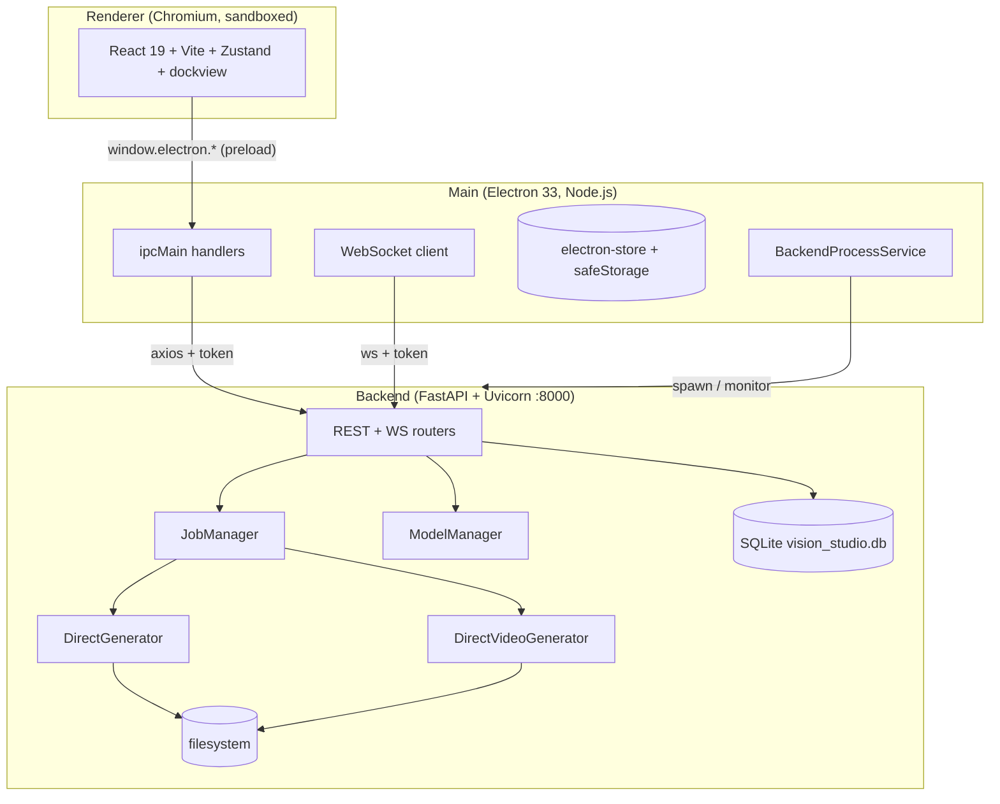

---

## 2. Composition root (Main process)

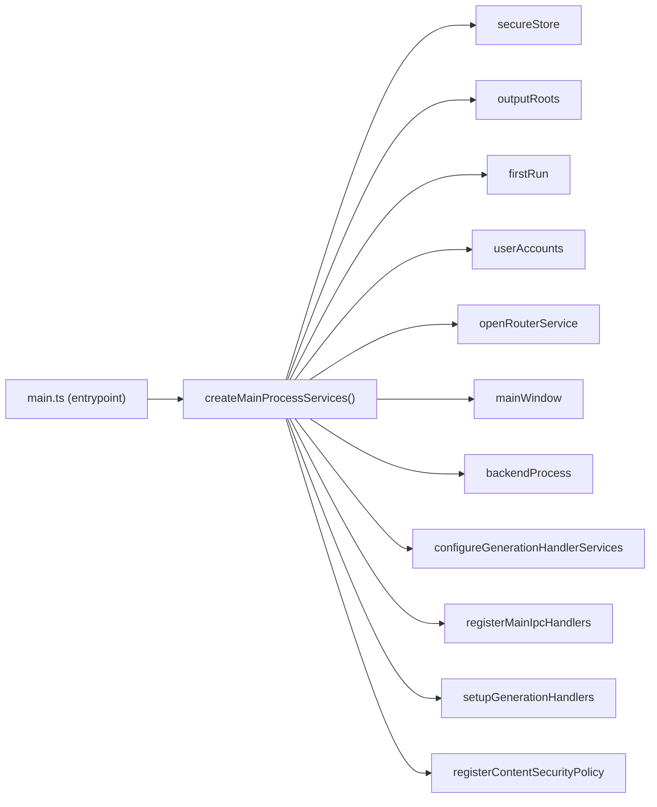

---

## 3. Image generation flow (local backend)

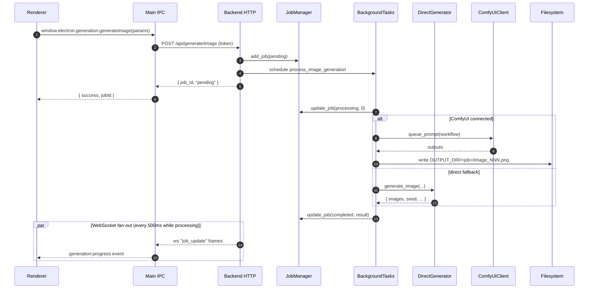

---

## 4. Image generation flow (OpenRouter route)

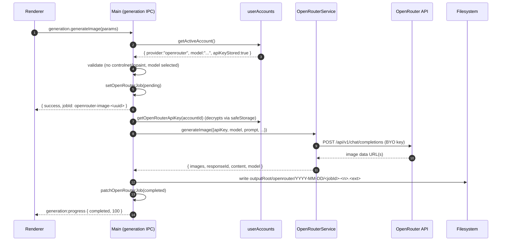

---

## 5. Settings update with backend restart

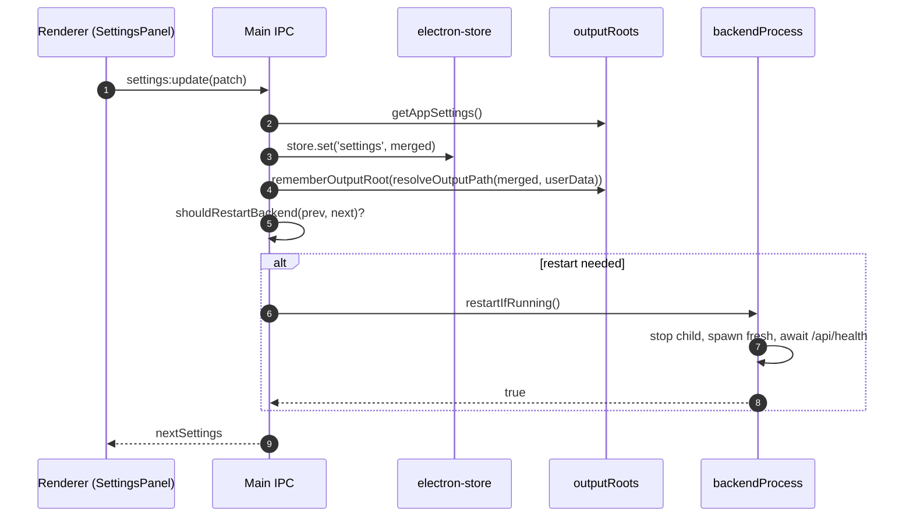

---

## 6. Asset import vs export (security paths)

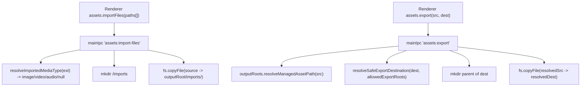

---

## 7. Job lifecycle

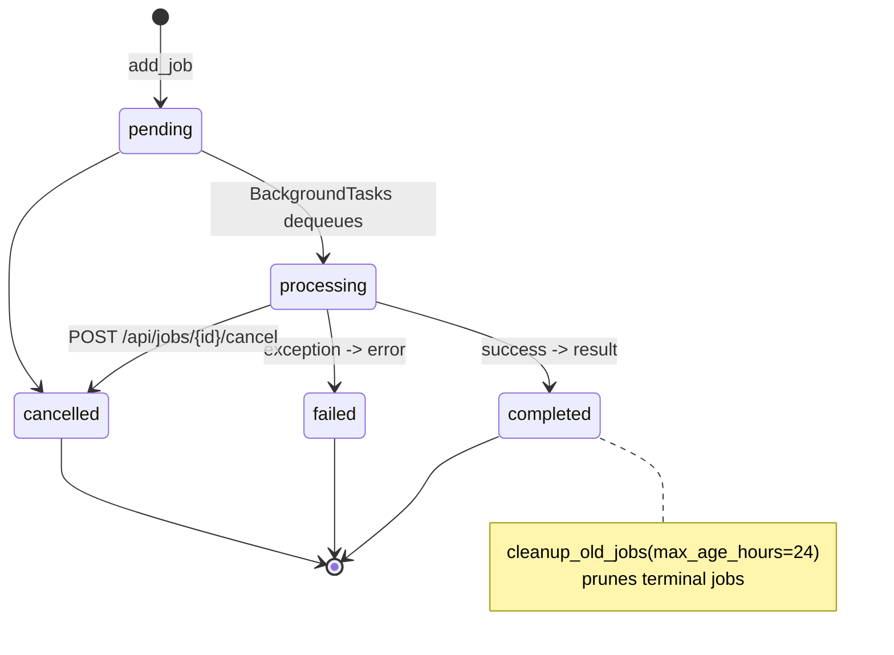

---

## 8. Database ER diagram

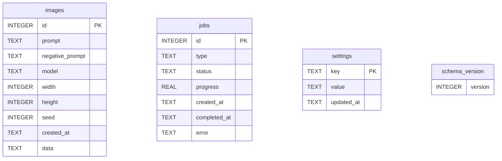

---

## 9. First launch sequence

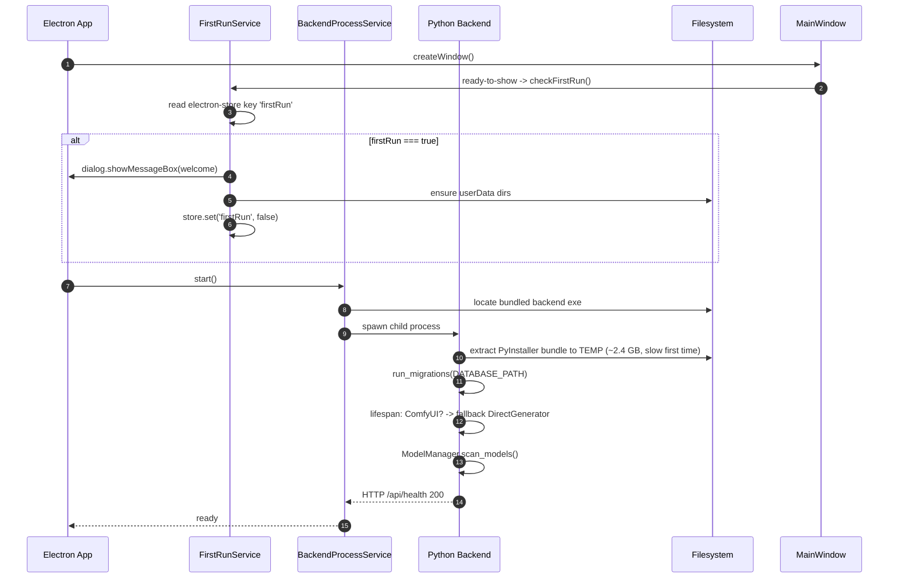

---

## 10. Release pipeline

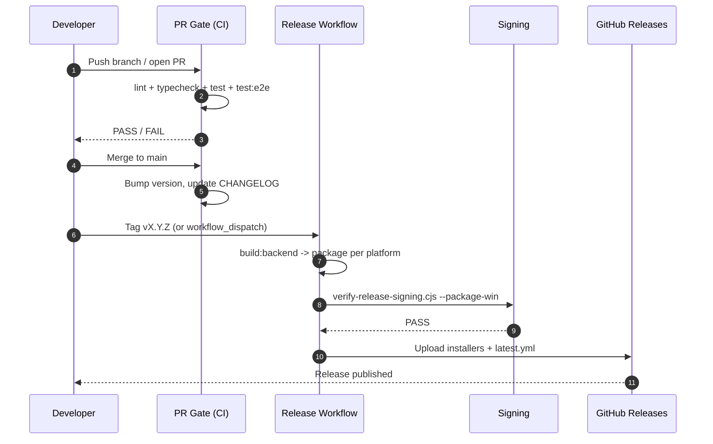

---

## 11. Trust boundary (textual)

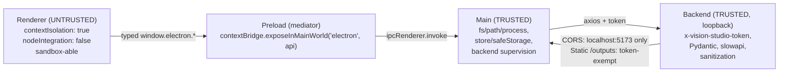
