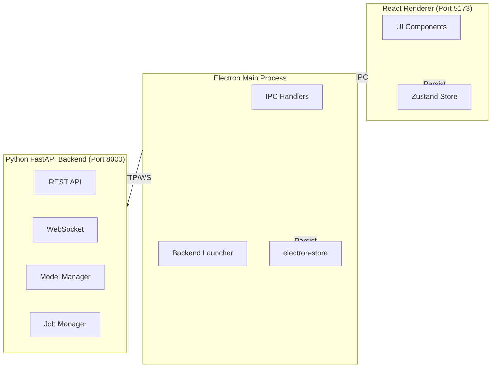

# Vision Studio Gap Analysis Remediation Plan

**Date:** 2026-04-12  
**Author:** Claude (Elite Partner)  
**Source:** Gap Analysis Audit (`AUDIT_2026-04-12.md`)  
**Status:** Ready for Execution

---

## Overview

This plan addresses the highest-priority gaps identified in the Vision Studio codebase audit. Focus is on P0 and P1 items that block production readiness.

**Scope:**
- P0: Component test coverage (15% → 80%+)
- P1: Accessibility violations (3 known → 0)
- P1: Missing documentation (CONTRIBUTING.md, architecture diagram)

**Out of Scope (deferred to future plans):**
- P2: AI editing tools backend (ControlNet, LoRA, rembg, etc.)
- P2: Visual regression tests
- P3: Code signing, store versioning

---

## Task 1: Component Test Coverage - Input & Textarea

**Priority:** P0  
**Files:** `src/components/ui/Input.tsx`, `src/components/ui/Textarea.tsx`  
**Estimate:** 30-45 minutes

**Requirements:**
1. Create `Input.test.tsx` with tests for:
   - Renders with value and placeholder
   - onChange callback fires with correct value
   - Disabled state renders correctly
   - Type attribute passes through (text, email, password, etc.)
   - autoFocus, required, readOnly props work
   - Keyboard input works (typing, selection)

2. Create `Textarea.test.tsx` with tests for:
   - Renders with value and placeholder
   - onChange callback fires with correct value
   - Disabled state renders correctly
   - rows prop sets correct height
   - Auto-resize works (if implemented)
   - Keyboard input works (typing, newlines)

**Success Criteria:**
- 8+ tests per component
- All tests passing
- @testing-library/react patterns (user-event for interactions)
- Coverage committed to git

---

## Task 2: Component Test Coverage - Switch & ConfirmDialog

**Priority:** P0  
**Files:** `src/components/ui/Switch.tsx`, `src/components/ui/ConfirmDialog.tsx`  
**Estimate:** 45-60 minutes

**Requirements:**
1. Create `Switch.test.tsx` with tests for:
   - Renders checked/unchecked states
   - onChange callback fires on click
   - Keyboard activation works (Space, Enter toggle state)
   - Disabled state prevents interaction
   - aria-checked, role="switch" attributes present
   - Label association works

2. Create `ConfirmDialog.test.tsx` with tests for:
   - Renders title and message
   - Confirm button calls onConfirm callback
   - Cancel button calls onCancel callback
   - Escape key closes dialog (calls onCancel)
   - Focus trap works (Tab cycles within dialog)
   - Focus restored to trigger element on close

**Success Criteria:**
- 10+ tests for Switch (including a11y)
- 8+ tests for ConfirmDialog
- All a11y attributes verified
- Coverage committed to git

---

## Task 3: Component Test Coverage - Tooltip & Skeleton

**Priority:** P0  
**Files:** `src/components/ui/Tooltip.tsx`, `src/components/ui/Skeleton.tsx`  
**Estimate:** 30-45 minutes

**Requirements:**
1. Create `Tooltip.test.tsx` with tests for:
   - Renders children correctly
   - Shows tooltip on hover
   - Shows tooltip on focus (keyboard)
   - Hides tooltip on blur
   - Tooltip has correct role and aria-describedby linkage
   - Positioning works (doesn't overflow viewport)

2. Create `Skeleton.test.tsx` with tests for:
   - Renders with correct dimensions (width, height)
   - Renders with correct variant (text, circle, rectangular)
   - Animation class applied
   - Border radius applied correctly

**Success Criteria:**
- 8+ tests for Tooltip (including a11y)
- 6+ tests for Skeleton
- All tests passing
- Coverage committed to git

---

## Task 4: Component Test Coverage - KeyboardShortcuts

**Priority:** P0  
**Files:** `src/components/ui/KeyboardShortcuts.tsx`  
**Estimate:** 30-45 minutes

**Requirements:**
1. Create `KeyboardShortcuts.test.tsx` with tests for:
   - Modal opens when open=true
   - Modal closes when open=false or onClose called
   - Renders all shortcut categories (Navigation, Generation, Edit, View)
   - Escape key closes modal
   - Focus trap works within modal
   - Shortcut table renders correctly (key combinations, descriptions)

**Success Criteria:**
- 8+ tests passing
- Modal a11y verified (role="dialog", aria-modal)
- Coverage committed to git

---

## Task 5: Fix Accessibility Violations - Color Contrast

**Priority:** P1  
**Files:** `src/index.css`, `src/components/layout/Sidebar.tsx`, multiple  
**Estimate:** 60-90 minutes

**Requirements:**
1. Audit all text colors against WCAG AAA (7:1 ratio)
2. Update `--color-text-body` from `#94949c` to meet contrast requirements
3. Update any `text-muted` usage that fails contrast
4. Verify status colors (success, warning, error, info) meet AA (4.5:1) minimum
5. Run axe-core audit to confirm fix

**Success Criteria:**
- `color-contrast` violation count: 0 (or baselined if intentional)
- All text passes WCAG AA minimum (4.5:1)
- AAA (7:1) for body text where possible
- Changes committed to git

---

## Task 6: Fix Accessibility Violations - ARIA Required Children

**Priority:** P1  
**Files:** `src/components/edit/ToolStrip.tsx`, `src/components/generate/PromptToolbar.tsx`  
**Estimate:** 30-45 minutes

**Requirements:**
1. Identify elements with `role="toolbar"`, `role="menu"`, `role="list"`
2. Add required child elements:
   - `toolbar` → children with `role="button"` or `role="menuitem"`
   - `menu` → children with `role="menuitem"`
   - `list` → children with `role="listitem"`
3. Alternatively, remove explicit roles if native HTML semantics suffice

**Success Criteria:**
- `aria-required-children` violations: 0
- Toolbars have proper button children
- Menus have proper menuitem children
- Changes committed to git

---

## Task 7: Fix Accessibility Violations - Nested Interactive

**Priority:** P1  
**Files:** Multiple (Button components, div[onClick] patterns)  
**Estimate:** 45-60 minutes

**Requirements:**
1. Find all instances of:
   - `
` containing `<button>`
   - `<button onClick>` containing `<button>` or `<a>`
   - Clickable cards with interactive children
2. Fix by:
   - Replacing div[onClick] with proper button elements
   - Using `onPointerDown` with `stopPropagation()` for nested clicks
   - Restructuring to avoid nested interactive elements

**Success Criteria:**
- `nested-interactive` violations: 0
- All interactive elements properly structured
- Changes committed to git

---

## Task 8: Create CONTRIBUTING.md

**Priority:** P1  
**Files:** `CONTRIBUTING.md` (new)  
**Estimate:** 30-45 minutes

**Requirements:**
Create comprehensive contributing guide covering:

1. **Development Setup**
   - Node.js 18+ installation
   - Python 3.10+ installation
   - CUDA 12.1 (optional, for GPU)
   - Clone and install commands

2. **Running the Application**
   - `npm install`
   - `npm run dev` (development)
   - `npm run build:backend` (bundle Python)
   - `npm run package` (build distributable)

3. **Running Tests**
   - `npm test` (Vitest suite)
   - `npm run test:e2e` (Playwright E2E)
   - `npm run typecheck` (TypeScript)
   - Backend tests: `python -m unittest discover`

4. **Code Style & Conventions**
   - TypeScript strict mode
   - Tailwind CSS classes (8pt grid)
   - Component naming conventions
   - Commit message format

5. **Pull Request Process**
   - Branch naming (feature/, fix/, chore/)
   - PR title format
   - Required checks (typecheck, tests)
   - Review expectations

6. **Issue Reporting**
   - Bug report template
   - Feature request template
   - What to include (logs, screenshots, steps to reproduce)

**Success Criteria:**
- CONTRIBUTING.md exists at repo root
- All sections complete and accurate
- Commands tested and working
- Committed to git

---

## Task 9: Create Architecture Diagram

**Priority:** P1  
**Files:** `docs/architecture.md` or add to `README.md`  
**Estimate:** 20-30 minutes

**Requirements:**
1. Create Mermaid diagram showing:
   - Three-tier architecture (Renderer → Main → Backend)
   - IPC communication flows
   - HTTP/WebSocket connections
   - Data flow for generation jobs
   - State persistence (Zustand + electron-store)

2. Add supporting text explaining:
   - Each layer's responsibilities
   - Trust boundaries
   - Key data flows

**Example Structure:**

**Success Criteria:**
- Diagram renders correctly in Markdown
- All major components shown
- Data flows documented
- Committed to git

---

## Execution Notes

**Test Stack:**
- Vitest 3.2.4 (test runner)
- @testing-library/react (component testing)
- @testing-library/user-event (interactions)
- jsdom (DOM environment)

**Accessibility Testing:**
- axe-core (automated checks)
- Manual keyboard navigation testing
- Screen reader spot checks (NVDA/VoiceOver)

**Git Workflow:**
- Branch: `feature/gap-analysis-remediation`
- Commits: One per task (atomic)
- PR: Single PR with all tasks, or grouped by type (tests, a11y, docs)

---

## Acceptance Criteria (All Tasks)

- [ ] All 9 tasks completed
- [ ] Component test coverage: 80%+ of UI components
- [ ] A11y violations: 0 (or baselined with justification)
- [ ] Documentation: CONTRIBUTING.md + architecture diagram exist
- [ ] All tests passing (vitest + Playwright)
- [ ] TypeScript compiles with no errors
- [ ] Code reviewed and approved
- [ ] Changes merged to main branch

---

## Deferred Items (Future Plans)

**P2 - Feature Completion:**
- ControlNet backend integration
- LoRA mixer backend API
- AI editing tools (rembg, Real-ESRGAN, GFPGAN)
- Batch ZIP export

**P2 - Quality Improvements:**
- Visual regression tests
- Performance benchmarks
- Structured logging

**P3 - Production Readiness:**
- Code signing (EV certificate)
- Store schema versioning
- Rate limiting + input sanitization

---

*Generated from Gap Analysis Audit - 2026-04-12*
